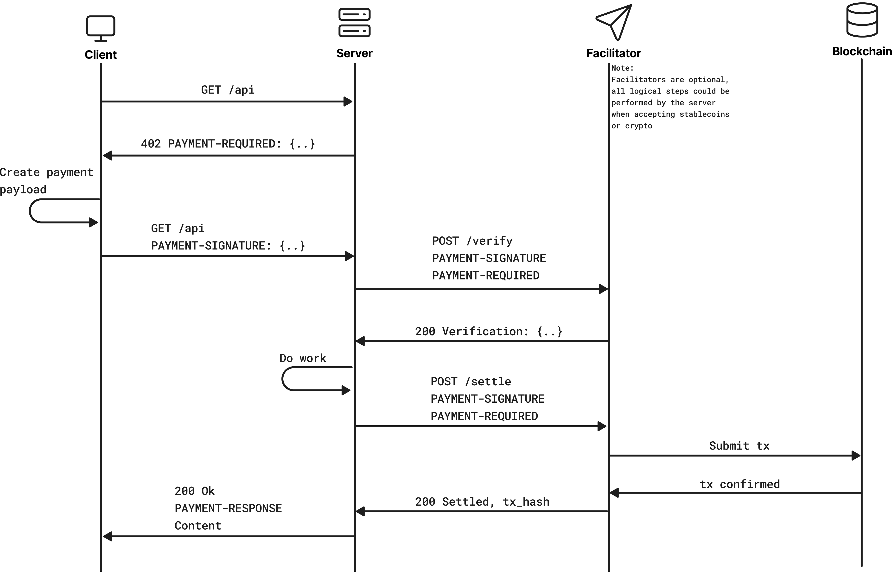

# x402

x402 is an open standard for internet native payments. It aims to support all networks (both crypto & fiat) and forms of value (stablecoins, tokens, fiat).

```typescript
app.use(
  paymentMiddleware(
    {
      "GET /weather": {
        accepts: [...],                 // As many networks / schemes as you want to support
        description: "Weather data",    // what your endpoint does
      },
    },
  ),
);
// That's it! See examples/ for full details
```

<details>
<summary><b>Installation</b></summary>

### Typescript

```shell
# All available reference sdks
npm install @x402/core @x402/evm @x402/svm @x402/axios @x402/fetch @x402/express @x402/hono @x402/next @x402/paywall @x402/extensions

# Minimal Fetch client
npm install @x402/core @x402/evm @x402/svm @x402/fetch

# Minimal express Server
npm install @x402/core @x402/evm @x402/svm @x402/express
```

### Python

```shell
pip install x402
```

### Go

```shell
go get github.com/coinbase/x402/go
```

</details>

## Principles

- **Open standard:** x402 is an open standard, freely accessible and usable by anyone. It will never force reliance on a single party.
- **HTTP / Transport Native:** x402 is meant to seamlessly complement existing data transportation. It should whenever possible not mandate additional requests outside the scope of a typical client / server flow.
- **Network, token, and currency agnostic:** we welcome contributions that add support for new networks (both crypto and fiat), signing standards, or schemes, so long as they meet our acceptance criteria laid out in [CONTRIBUTING.md](https://github.com/coinbase/x402/blob/main/CONTRIBUTING.md). x402 may extend support to fiat based networks, but will never deprioritize onchain payments in favor of fiat payments.
- **Backwards Compatible:** x402 will not deprecate support for any existing networks unless such removal is deemed necessary for the security of the standard. Whenever possible, x402 will aim for backwards compatibility for non-major version changes.
- **Trust minimizing:** all payment schemes must not allow for the facilitator or resource server to move funds, other than in accordance with client intentions
- **Easy to use:** It is the goal of the x402 community to improve ease of use relative to other forms of payment on the Internet. This means abstracting as many details of crypto as possible away from the client and resource server, and into the facilitator. This means the client/server should not need to think about gas, rpc, etc.

## Ecosystem

The x402 ecosystem is growing! Check out our [ecosystem page](https://x402.org/ecosystem) to see projects building with x402, including:

- Client-side integrations
- Services and endpoints
- Ecosystem infrastructure and tooling
- Learning and community resources

Want to add your project to the ecosystem? See our [demo site README](https://github.com/coinbase/x402/tree/main/typescript/site#adding-your-project-to-the-ecosystem) for detailed instructions on how to submit your project.

**Roadmap:** see [ROADMAP.md](https://github.com/coinbase/x402/blob/main/ROADMAP.md)

**Documentation:** see [docs/](./docs/) for the GitBook documentation source

## Security Best Practices

As the x402 ecosystem grows and AI agents begin making autonomous payments, it's important to assess counterparty risk before sending payments. This is especially critical for regulatory compliance (sanctions screening) and preventing financial losses to malicious services.

### Counterparty Risk Assessment

Before making x402 payments, consider checking:

**Domain & Service Validation:**
- Domain reputation and registration history
- IP geolocation and hosting provider
- SSL certificate validity and issuer
- Service uptime and response reliability

**Wallet & On-Chain Analysis:**
- Recipient wallet transaction history and age  
- On-chain behavior patterns across multiple networks
- Wallet holdings and economic substance
- Sanctions screening (OFAC and other watchlists)

**Service-Specific Checks:**
- Service documentation quality and transparency
- API response consistency and error handling
- Community reputation and user feedback
- Support responsiveness and issue resolution

### Available Risk Assessment Tools

The x402 ecosystem includes several tools for automated counterparty risk checking:

- **Revettr** - Comprehensive risk scoring with domain, IP, wallet, and sanctions screening. Provides [SafeX402Client](https://github.com/AlexanderLawson17/revettr-python) wrapper with automatic pre-payment risk checks
- **InsumerAPI** - Cross-chain wallet trust profiles covering governance, staking, NFTs, and stablecoins across 33+ networks
- **Agent Trust Score** - DID-based identity verification and behavioral trust scoring for AI agents

### Implementation Guidelines

**For Client Applications:**
- Implement allowlist/blocklist management for known good/bad services
- Set spending limits per service, per transaction, and daily totals
- Log all payment attempts with risk scores for audit trails
- Implement circuit breakers for services with high failure rates
- Use multi-signature or approval workflows for high-value payments

**For Service Operators:**
- Clearly document your service capabilities and pricing
- Maintain consistent API responses and error messages
- Provide transparency about data sources and processing
- Implement proper rate limiting and abuse prevention
- Consider obtaining third-party security audits

**Network & Infrastructure Security:**
- Always use HTTPS for x402 communications
- Verify facilitator SSL certificates and reputation
- Monitor facilitator health and response times
- Implement retry logic with exponential backoff
- Use secure key management for payment signing

### Regulatory Compliance

For production deployments, especially those handling large volumes or serving regulated entities:

- Implement sanctions screening against OFAC and other relevant watchlists
- Maintain audit logs of all payment decisions and risk assessments
- Consider KYC/AML requirements for high-value or repeated transactions
- Review compliance requirements in your jurisdiction
- Implement transaction monitoring for suspicious patterns

Remember: **the goal is not to eliminate all risk, but to make informed decisions based on your risk tolerance and use case requirements.**

## Terms:

- `resource`: Something on the internet. This could be a webpage, file server, RPC service, API, any resource on the internet that accepts HTTP / HTTPS requests.
- `client`: An entity wanting to pay for a resource.
- `facilitator`: A server that facilitates verification and execution of payments for one or many networks.
- `resource server`: An HTTP server that provides an API or other resource for a client.

## Technical Goals:

- Permissionless and secure for clients, servers, and facilitators
- Minimal friction to adopt for both client and resource servers
- Minimal integration for the resource server and client (1 line for the server, 1 function for the client)
- Ability to trade off speed of response for guarantee of payment
- Extensible to different payment flows and networks

## Specification

See `specs/` for full documentation of the x402 standard/

### Typical x402 flow

x402 payments typically adhere to the following flow, but servers have a lot of flexibility. See `advanced` folders in `examples/`.


The following outlines the flow of a payment using the `x402` protocol. Note that steps (1) and (2) are optional if the client already knows the payment details accepted for a resource.

1. `Client` makes an HTTP request to a `resource server`.

2. `Resource server` responds with a `402 Payment Required` status and a `PaymentRequired` b64 object return as a `PAYMENT-REQUIRED` header.

3. `Client` selects one of the `PaymentRequirements` returned by the server response and creates a `PaymentPayload` based on the `scheme` & `network` of the `PaymentRequirements` they have selected.

4. `Client` sends the HTTP request with the `PAYMENT-SIGNATURE` header containing the `PaymentPayload` to the resource server.

5. `Resource server` verifies the `PaymentPayload` is valid either via local verification or by POSTing the `PaymentPayload` and `PaymentRequirements` to the `/verify` endpoint of a `facilitator`.

6. `Facilitator` performs verification of the object based on the `scheme` and `network` of the `PaymentPayload` and returns a `Verification Response`.

7. If the `Verification Response` is valid, the resource server performs the work to fulfill the request. If the `Verification Response` is invalid, the resource server returns a `402 Payment Required` status and a `Payment Required Response` JSON object in the response body.

8. `Resource server` either settles the payment by interacting with a blockchain directly, or by POSTing the `Payment Payload` and `Payment PaymentRequirements` to the `/settle` endpoint of a `facilitator server`.

9. `Facilitator server` submits the payment to the blockchain based on the `scheme` and `network` of the `Payment Payload`.

10. `Facilitator server` waits for the payment to be confirmed on the blockchain.

11. `Facilitator server` returns a `Payment Execution Response` to the resource server.

12. `Resource server` returns a `200 OK` response to the `Client` with the resource they requested as the body of the HTTP response, and a `PAYMENT-RESPONSE` header containing the `Settlement Response` as Base64 encoded JSON if the payment was executed successfully.

### Schemes

A scheme is a logical way of moving money.

Blockchains allow for a large number of flexible ways to move money. To help facilitate an expanding number of payment use cases, the `x402` protocol is extensible to different ways of settling payments via its `scheme` field.

Each payment scheme may have different operational functionality depending on what actions are necessary to fulfill the payment.
For example `exact`, the first scheme shipping as part of the protocol, would have different behavior than `upto`. `exact` transfers a specific amount (ex: pay $1 to read an article), while a theoretical `upto` would transfer up to an amount, based on the resources consumed during a request (ex: generating tokens from an LLM).

See `specs/schemes` for more details on schemes, and see `specs/schemes/exact/scheme_exact_evm.md` to see the first proposed scheme for exact payment on EVM chains.

### Schemes vs Networks

Because a scheme is a logical way of moving money, the way a scheme is implemented can be different for different blockchains. (ex: the way you need to implement `exact` on Ethereum is very different from the way you need to implement `exact` on Solana).

Clients and facilitators must explicitly support different `(scheme, network)` pairs in order to be able to create proper payloads and verify / settle payments.
