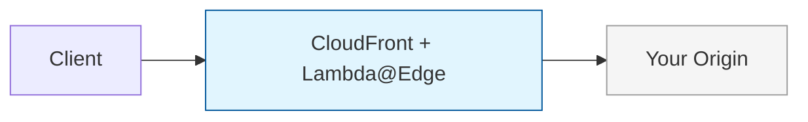
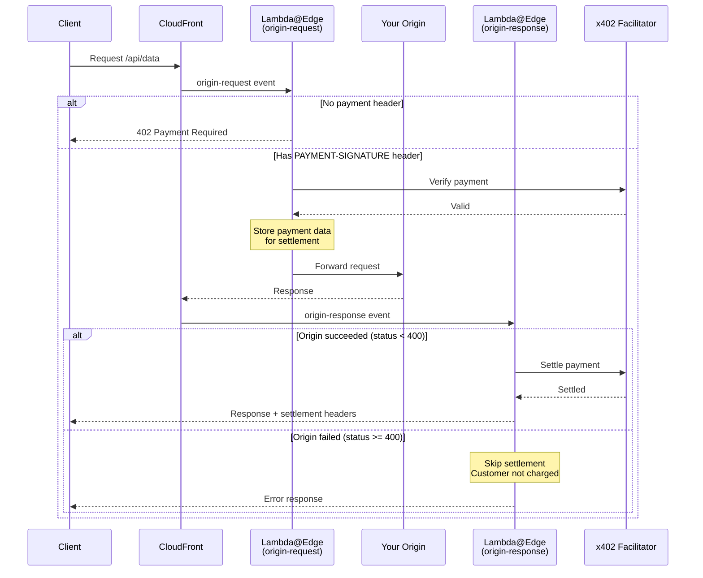

# x402 CloudFront + Lambda@Edge

Add x402 payments to any web server without modifying your backend.




## Why This Approach?

- **Zero backend changes** — your origin server stays untouched
- **Works with any origin** — APIs, static sites, cached or non-cached content
- **Any cloud or on-prem** — AWS, GCP, Azure, third-party services, or your own infrastructure
- **Drop-in monetization** — add payments to existing endpoints in minutes
- **Edge performance** — payment verification at CloudFront's global edge locations
- **Fair billing** — customers only charged when the request succeeds

## Getting Started

### Already using CloudFront + Lambda@Edge?

The example files are ready for you to add your business logic:

| File                                                                 | Purpose                                           |
| -------------------------------------------------------------------- | ------------------------------------------------- |
| [`lambda/src/config.ts`](./lambda/src/config.ts)                     | Configure facilitator, routes, pricing, addresses |
| [`lambda/src/origin-request.ts`](./lambda/src/origin-request.ts)     | Customize the origin-request handler              |
| [`lambda/src/origin-response.ts`](./lambda/src/origin-response.ts)   | Customize the origin-response handler             |
| [`lambda/src/facilitator-auth.ts`](./lambda/src/facilitator-auth.ts) | CDP authentication (for mainnet)                  |

Copy these into your project and integrate with your existing setup.

### New to CloudFront or Lambda@Edge?

This example is a great starting point. Here are the essentials:

**CloudFront basics:**
- [What is Amazon CloudFront?](https://docs.aws.amazon.com/AmazonCloudFront/latest/DeveloperGuide/Introduction.html)
- [Getting started with CloudFront](https://docs.aws.amazon.com/AmazonCloudFront/latest/DeveloperGuide/GettingStarted.html)

**Lambda@Edge basics:**
- [What is Lambda@Edge?](https://docs.aws.amazon.com/AmazonCloudFront/latest/DeveloperGuide/lambda-at-the-edge.html)
- [Tutorial: Creating a Lambda@Edge function](https://docs.aws.amazon.com/AmazonCloudFront/latest/DeveloperGuide/lambda-edge-how-it-works-tutorial.html)

<details>
<summary>Lambda@Edge constraints to keep in mind</summary>

| Constraint            | Details                                    |
| --------------------- | ------------------------------------------ |
| Region                | Must deploy to `us-east-1`                 |
| Environment variables | Not supported — config is bundled in code  |
| Timeout               | Max 30 seconds for origin-request/response |
| Response size         | Max 1MB for generated responses            |

See [Lambda@Edge quotas](https://docs.aws.amazon.com/AmazonCloudFront/latest/DeveloperGuide/edge-functions-restrictions.html) for the full list.

</details>

---

## Quick Start

### 1. Copy the Lambda Source

Copy `lambda/src/` into your project and adapt the build to your tooling.

> **Note**: Replace `workspace:*` dependencies with specific versions:
> ```json
> "@x402/core": "^2.2.0",
> "@x402/evm": "^2.2.0"
> ```

### 2. Configure Your Facilitator

Edit `config.ts` to set your facilitator URL:

```typescript
// Testnet (no auth required)
export const FACILITATOR_URL = 'https://x402.org/facilitator';

// Or mainnet with CDP (requires auth - see facilitator-auth.ts)
// export const FACILITATOR_URL = 'https://api.cdp.coinbase.com/platform/v2/x402';
```

### 3. Configure Payment Settings

```typescript
export const NETWORK = 'eip155:84532';              // Base Sepolia (testnet)
export const PAY_TO = '0xYourPaymentAddressHere';   // Your wallet address
```

### 4. Configure Routes

Define which routes require payment:

```typescript
export const ROUTES: RoutesConfig = {
  '/api/*': {
    accepts: {
      scheme: 'exact',
      network: NETWORK,
      payTo: PAY_TO,
      price: '$0.001',
    },
    description: 'API access',
  },
};
```

### 5. Deploy

Bundle and deploy both Lambda functions:

| Lambda Function         | CloudFront Event | Purpose                            |
| ----------------------- | ---------------- | ---------------------------------- |
| `originRequestHandler`  | origin-request   | Verify payment, forward to origin  |
| `originResponseHandler` | origin-response  | Settle payment if origin succeeded |

```typescript
import { originRequestHandler, originResponseHandler } from './index';
```

---

## Networks

| Network        | ID                                        | Use        |
| -------------- | ----------------------------------------- | ---------- |
| Base Sepolia   | `eip155:84532`                            | Testing    |
| Base Mainnet   | `eip155:8453`                             | Production |
| Solana Devnet  | `solana:EtWTRABZaYq6iMfeYKouRu166VU2xqa1` | Testing    |
| Solana Mainnet | `solana:5eykt4UsFv8P8NJdTREpY1vzqKqZKvdp` | Production |

---

## Running on Mainnet

To accept real USDC payments, you need to:
1. Use a mainnet facilitator (e.g., CDP)
2. Configure authentication if required by the facilitator
3. Use a mainnet network and wallet address

### Using CDP Facilitator

1. Get API keys at [cdp.coinbase.com](https://cdp.coinbase.com)
2. Update `config.ts`:

```typescript
// Change facilitator type to CDP
export const FACILITATOR_TYPE: FacilitatorType = 'cdp';
export const FACILITATOR_URL = 'https://api.cdp.coinbase.com/platform/v2/x402';
export const NETWORK = 'eip155:8453'; // Base mainnet
export const PAY_TO = '0xYourMainnetWalletAddress';

// Configure your CDP credentials
export const CDP_API_KEY_ID = 'your-cdp-api-key-id';
export const CDP_API_KEY_SECRET = 'your-cdp-api-key-secret-here';
```

The `getAuthHeaders()` function in `config.ts` automatically uses `createCDPAuthHeaders()` from `facilitator-auth.ts` when `FACILITATOR_TYPE` is set to `'cdp'`.

### Production Secrets Management

⚠️ **Lambda@Edge does not support environment variables**

**For demos**: Credentials are bundled in `facilitator-auth.ts` (not secure)

**For production**: Use AWS Secrets Manager (see comments in `facilitator-auth.ts`)

---

## File Structure

```
cloudfront-lambda-edge/
├── lambda/src/
│   ├── index.ts              # Main exports
│   ├── config.ts             # Facilitator, routes, network config
│   ├── facilitator-auth.ts   # CDP authentication helpers
│   ├── origin-request.ts     # Handler for origin-request event
│   ├── origin-response.ts    # Handler for origin-response event
│   └── lib/                  # Reusable x402 middleware (future @x402/lambda-edge)
│       ├── index.ts          # Package exports
│       ├── middleware.ts     # createX402Middleware factory
│       ├── server.ts         # createX402Server factory
│       ├── adapter.ts        # CloudFrontHTTPAdapter
│       └── responses.ts      # Lambda@Edge response helpers
```

---

## Middleware Pattern

The `lib/` folder follows the same pattern as `@x402/express`, `@x402/hono`, etc.:

```typescript
import { createX402Middleware, MiddlewareResultType } from './lib';

// Create middleware with config
const x402 = createX402Middleware({
  facilitatorUrl: 'https://x402.org/facilitator',
  network: 'eip155:84532',
  routes: {
    '/api/*': {
      accepts: { scheme: 'exact', network: 'eip155:84532', payTo: '0x...', price: '$0.01' },
      description: 'API access',
    },
  },
  // For mainnet with CDP:
  // createAuthHeaders: createCDPAuthHeaders({ apiKeyId, apiKeySecret }),
});

// Use in handlers
export const handler = async (event: CloudFrontRequestEvent) => {
  const request = event.Records[0].cf.request;
  const distributionDomain = event.Records[0].cf.config.distributionDomainName;
  
  // Your custom logic first (auth, WAF, logging, etc.)
  
  const result = await x402.processOriginRequest(request, distributionDomain);
  
  if (result.type === MiddlewareResultType.RESPOND) {
    return result.response; // 402 Payment Required
  }
  
  return result.request;
};
```

---

## Advanced Patterns

<details>
<summary>WAF Integration for Bot Protection</summary>

Use AWS WAF to label bots, then require payment only for labeled requests:

```typescript
const isBot = request.headers['x-amzn-waf-bot']?.[0]?.value;
if (isBot) {
  // Add bot-specific routes or pricing
}
```

This lets you monetize bot/scraper traffic while keeping human users free.

</details>

<details>
<summary>Caching Optimization</summary>

CloudFront caching can reduce facilitator calls:

- **Unpaid requests**: Cache 402 responses so repeated requests without payment don't hit Lambda@Edge
- **Token-based payments**: Cache responses by payment token

Configure cache behaviors to include `PAYMENT-SIGNATURE` header in the cache key.

</details>

<details>
<summary>Cookie-Based Sessions</summary>

For browser apps, extend `CloudFrontHTTPAdapter` to read from cookies:

```typescript
getHeader(name: string): string | undefined {
  if (name.toLowerCase() === 'payment-signature') {
    const cookie = this.request.headers.cookie?.[0]?.value;
    const match = cookie?.match(/x402-payment=([^;]+)/);
    if (match) return decodeURIComponent(match[1]);
  }
  return this.request.headers[name.toLowerCase()]?.[0]?.value;
}
```

</details>

<details>
<summary>Payment Flow Internals</summary>

**Why two Lambda functions?**

The x402 pattern is: verify → execute → settle. By splitting into two functions:
- **origin-request**: Verifies payment, stores data in `x-x402-pending-settlement` header
- **origin-response**: Settles only if status < 400

This ensures customers only pay for successful requests.



**Security**: Any client-injected `x-x402-pending-settlement` header is automatically removed to prevent payment bypass attacks.

</details>
