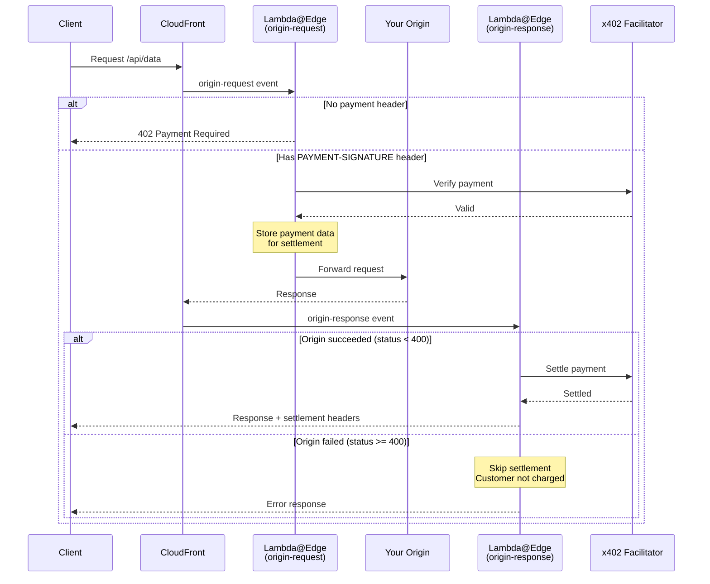

# x402 CloudFront + Lambda@Edge

Add x402 payments to any web server without modifying your backend. Put CloudFront in front of your origin, and Lambda@Edge handles all payment logic at the edge.

> **Reference Implementation**: This is a reference approach demonstrating the pattern. Actual deployment and code bundling will depend on your project's infrastructure and build tooling (CDK, Terraform, SAM, Serverless Framework, etc.).

## Why This Approach?

- **Zero backend changes**: Your origin server stays untouched
- **Any origin, anywhere**: Works with any HTTP server — AWS, GCP, Azure, on-prem, or third-party APIs
- **Drop-in monetization**: Add payments to existing APIs in minutes
- **Edge performance**: Payment verification at CloudFront's global edge locations
- **Uses @x402/core**: Leverages `x402HTTPResourceServer` for consistent behavior with other x402 implementations
- **Fair billing**: Customers only charged when API succeeds (verify → execute → settle pattern)

## How It Works



The implementation uses two Lambda@Edge functions:
1. **origin-request**: Verifies payment and forwards valid requests to origin
2. **origin-response**: Settles payment only if origin returned success (status < 400)

This ensures customers are never charged for failed API requests.

## Quick Start

### 1. Copy the Lambda Source

Copy the `lambda/src/` directory into your project and adapt the build process to your tooling.

> **Note**: The `lambda/package.json` uses `workspace:*` for monorepo development. When copying this example to a standalone project, replace with specific versions:
> ```json
> "@x402/core": "^2.2.0",
> "@x402/evm": "^2.2.0"
> ```

### 2. Configure Payment Settings

Edit `config.ts` to configure your deployment:

```typescript
// Payment configuration
export const FACILITATOR_URL = 'https://x402.org/facilitator';
export const PAY_TO = '0xYourPaymentAddressHere';  // Your wallet address
export const NETWORK = 'eip155:84532';              // Base Sepolia (testnet) or 'eip155:8453' (mainnet)
```

### 3. Configure Routes

Define which routes require payment in `config.ts`:

```typescript
const ROUTES: RoutesConfig = {
  '/api/*': {
    accepts: {
      scheme: 'exact',
      network: 'eip155:84532',
      payTo: '0xYourAddress',
      price: '$0.001',
    },
    description: 'API access',
  },
  '/api/premium/**': {
    accepts: {
      scheme: 'exact',
      network: 'eip155:84532',
      payTo: '0xYourAddress',
      price: '$0.01',
    },
    description: 'Premium API access',
  },
};
```

The route configuration uses the same `RouteConfig` type from `@x402/core/server`, ensuring consistency with other x402 implementations.

### 4. Deploy

Bundle and deploy both Lambda functions using your preferred tooling (CDK, SAM, Terraform, etc.):

| Lambda Function         | CloudFront Event | Purpose                            |
| ----------------------- | ---------------- | ---------------------------------- |
| `originRequestHandler`  | origin-request   | Verify payment, forward to origin  |
| `originResponseHandler` | origin-response  | Settle payment if origin succeeded |

Both handlers are exported from `index.ts`:

```typescript
import { originRequestHandler, originResponseHandler } from './index';
```

## Networks

| Network      | ID             | Use        |
| ------------ | -------------- | ---------- |
| Base Sepolia | `eip155:84532` | Testing    |
| Base Mainnet | `eip155:8453`  | Production |

## File Structure

```
cloudfront-lambda-edge/
├── lambda/src/
│   ├── index.ts           # Main exports
│   ├── origin-request.ts  # Handler for origin-request event
│   ├── origin-response.ts # Handler for origin-response event
│   ├── config.ts          # User config: routes, addresses, network
│   └── lib/               # Future @x402/lambda-edge package
│       ├── index.ts       # Library exports
│       ├── middleware.ts  # createX402Middleware factory
│       ├── server.ts      # createX402Server factory
│       ├── adapter.ts     # CloudFrontHTTPAdapter
│       └── responses.ts   # Lambda@Edge response helpers
└── cdk/                   # Optional: Infrastructure as code
```

### Middleware Pattern

The x402 logic is implemented as composable middleware, not full handlers. This lets you integrate x402 with your existing Lambda@Edge logic:

```typescript
import { createX402Middleware } from './lib';

const x402 = createX402Middleware({ getServer: createServer });

export const handler = async (event: CloudFrontRequestEvent) => {
  const request = event.Records[0].cf.request;
  
  // Your custom logic first (auth, WAF, logging, etc.)
  if (request.headers['x-api-key']?.[0]?.value !== 'secret') {
    return { status: '401', body: 'Unauthorized' };
  }
  
  // x402 payment check
  const result = await x402.processOriginRequest(request, distributionDomain);
  
  if (result.type === 'respond') {
    return result.response; // 402 Payment Required
  }
  
  // More custom logic, then forward to origin
  return result.request;
};
```

### Library Structure

The `lib/` folder contains reusable code that will become `@x402/lambda-edge`:

```typescript
// Future usage:
import { createX402Middleware, CloudFrontHTTPAdapter } from '@x402/lambda-edge';

const x402 = createX402Middleware({
  getServer: async () => { /* your config */ }
});
```

## Payment Flow Details

### Why Two Lambda Functions?

The x402 pattern is: **verify → API execution → settle**

If settlement happens before the API executes (in origin-request), customers get charged even when the API fails. By splitting into two functions:

1. **origin-request**: Verifies payment is valid, stores payment data in a custom header
2. **origin-response**: Checks origin status, settles only if status < 400

This ensures fair billing — customers only pay for successful requests.

### Internal Headers

The origin-request handler passes payment data to origin-response via the `x-x402-pending-settlement` header. This header:
- Is base64-encoded JSON containing payment payload and requirements
- Is automatically stripped from the final response
- Never reaches your origin server (CloudFront internal)
- **Security**: Any client-injected `x-x402-pending-settlement` header is automatically removed by the origin-request handler to prevent payment bypass attacks

## Advanced Patterns

### WAF Integration for Bot Protection

AWS WAF associated with CloudFront to label bots or suspicious traffic. Lambda@Edge can then check these labels and require payment only for labeled requests:

```typescript
// In your Lambda@Edge handler, before processing
const isBot = request.headers['x-amzn-waf-bot']?.[0]?.value;

if (isBot) {
  // Add bot-specific routes or pricing
}
```

This lets you monetize bot/scraper traffic while keeping human users free.

### Caching Optimization

CloudFront caching can reduce facilitator and Lambda@Edge calls for repeated requests:

- **Unpaid requests**: Cache 402 responses so repeated requests without payment don't hit Lambda@Edge
- **Token-based payments**: Cache responses by payment token to serve repeated requests with the same token from edge cache

Configure cache behaviors to include `PAYMENT-SIGNATURE` header in the cache key, allowing paid responses to be cached per-token.

### Cookie-Based Sessions

The current implementation reads payment info from the `PAYMENT-SIGNATURE` header. For session-based flows (e.g., browser apps), you can extend the `CloudFrontHTTPAdapter` to read from cookies:

```typescript
getHeader(name: string): string | undefined {
  if (name.toLowerCase() === 'payment-signature') {
    // Check cookie first
    const cookie = this.request.headers.cookie?.[0]?.value;
    const match = cookie?.match(/x402-payment=([^;]+)/);
    if (match) return decodeURIComponent(match[1]);
  }
  return this.request.headers[name.toLowerCase()]?.[0]?.value;
}
```

This enables payment persistence across page navigations without requiring the client to attach headers to every request.

## Notes

- Lambda@Edge must deploy to `us-east-1`
- No env vars in Lambda@Edge — config is bundled in the code
- Max 30s timeout for origin-request, 30s for origin-response
- Add `PAYMENT-SIGNATURE` to CloudFront cache key headers
- Server is initialized lazily on first request and reused across invocations
- **Paywall disabled**: HTML paywall for browsers is disabled by default since Lambda@Edge responses are limited to 1MB. For browser-based payment flows, you can have Lambda@Edge dynamically generate and upload the paywall HTML to S3, then use origin routing to serve the hosted HTML for a seamless experience.
