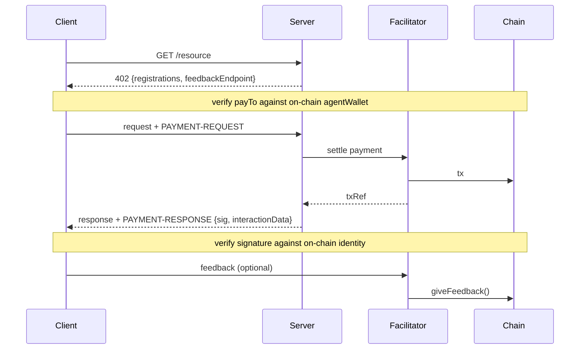

# Extension: `8004-reputation`

## Summary

The `8004-reputation` extension enables **on-chain reputation and proof-of-service** for x402 agents. Agents declare their identity on ERC-8004 compliant reputation registries and provide cryptographic signatures proving service completion. Clients can verify these signatures and submit verifiable feedback linked to payment transactions.

**Key features:**
- Agents sign every response before knowing client feedback (blind commitment)
- Multi-chain identity support (ERC-8004 compliant registries on EVM and Solana)
- Registry-agnostic design (works with any ERC-8004 compliant registry)
- Payment address verification (prevent fraud from compromised servers)

The extension is organized into three parts: server extension ([§1](#1-server-extension)), client extension ([§2](#2-client-extension)), and facilitator feedback API ([§3](#3-facilitator-feedback-api)).

---

## Protocol Flow



The `8004-reputation` extension adds identity, signatures, and feedback to the standard x402 payment flow:

1. **Server declares identity**: Includes `8004-reputation` extension in 402 response with agent registrations and optional `feedbackEndpoint` URL ([§1](#1-server-extension))
2. **Client verifies payment address**: Resolves agent's registration file and confirms `payTo` matches declared wallet ([§2](#2-client-extension))
3. **Payment settlement**: Client pays, facilitator settles (standard x402 flow)
4. **Server signs response**: Computes interaction hash over request + response, signs with authorized key, includes in `PAYMENT-RESPONSE` header ([§1](#1-server-extension))
5. **Client verifies signature**: Fetches registration file, verifies signature against on-chain `agentWallet` ([§2](#2-client-extension))
6. **Client submits feedback** (optional): Via facilitator ([§3](#3-facilitator-feedback-api)) or directly on-chain ([§2](#2-client-extension))

**Reading guide:** Section 1 covers server identity declaration and response signing. Section 2 covers client-side verification and feedback submission. Section 3 covers the facilitator's feedback API. Reviewers short on time should read the overview diagram and Section 1.

**Conventions:**
- All hex-encoded values (hashes, signatures) use `0x` prefix unless otherwise noted
- **0x prefix normalization:** Public keys in registration file `signers` array (see [Dedicated Signing Keys](#dedicated-signing-keys-advanced)) use hex encoding **without** `0x` prefix (per ERC-8004 convention). `InteractionData.agentSignerPublicKey` uses `0x` prefix. Implementations MUST normalize by stripping or adding the prefix before comparison. As a general rule: strip `0x` prefixes before any byte-level comparison or hash input.
- `||` denotes byte concatenation
- All hashing uses keccak256 across both EVM and Solana (Solana provides `keccak::hashv` as a native syscall, ensuring cross-chain verification consistency)
- This extension is fully optional. Clients that do not recognize `8004-reputation` in the 402 response ignore it and proceed with standard x402 payment.
- This extension does not define `PaymentPayload` behavior. Extension data flows server-to-client only.

---

## 1. Server Extension

The server extension covers what a resource server (agent) must implement: declaring identity in 402 responses, signing interaction data in payment responses, and publishing a registration file.

### Declaring Identity (`PaymentRequired`)

A resource server advertises reputation support by including the `8004-reputation` extension in the `extensions` object of the **402 Payment Required** response. Per x402 convention, each extension includes an `info` object (runtime data) and a `schema` object (JSON Schema for validation). The schema is shown once below in [Extension Schema](#extension-schema); examples abbreviate it for readability.

#### Example: 402 Response with Identity

Single-chain agents include one `accepts` entry and one registration. The example below shows a multi-chain agent accepting payments on both Base and Solana:

```json
{
  "x402Version": 2,
  "resource": {
    "url": "https://agent.example/weather",
    "description": "Weather data API"
  },
  "accepts": [
    {
      "scheme": "exact",
      "network": "eip155:8453",
      "asset": "0x833589fCD6eDb6E08f4c7C32D4f71b54bdA02913",
      "payTo": "0xBaseWallet...",
      "amount": "1000"
    },
    {
      "scheme": "exact",
      "network": "solana:5eykt4UsFv8P8NJdTREpY1vzqKqZKvdp",
      "asset": "EPjFWdd5AufqSSqeM2qN1xzybapC8G4wEGGkZwyTDt1v",
      "payTo": "SolanaWallet...",
      "amount": "1000"
    }
  ],
  "extensions": {
    "8004-reputation": {
      "info": {
        "version": "1.0.0",
        "registrations": [
          {
            "agentRegistry": "eip155:8453:0x8004A818BFB912233c491871b3d84c89A494BD9e",
            "agentId": "42"
          },
          {
            "agentRegistry": "solana:5eykt4UsFv8P8NJdTREpY1vzqKqZKvdp:satiRkxEiwZ51cv8PRu8UMzuaqeaNU9jABo6oAFMsLe",
            "agentId": "7xKXtg2CW87d97TXJSDpbD5jBkheTqA83TZRuJosgAsU"
          }
        ],
        "feedbackEndpoint": "https://facilitator.example/feedback"
      },
      "schema": "...see Extension Schema below..."
    }
  }
}
```

### ReputationInfo Structure

#### Required Fields

| Field | Type | Required | Description |
|-------|------|----------|-------------|
| `version` | string | Yes | Extension version (e.g., `"1.0.0"`) |
| `registrations` | array | Yes | Agent identity registrations (at least one) |
| `feedbackEndpoint` | string | No | Facilitator endpoint for gas-free feedback submission |

> *Informative.* The facilitator's settlement chain (where it submits feedback on-chain) does not need to match the payment chain (payment and identity are decoupled). Agents declare identity registrations and configure a feedback endpoint; the facilitator settles on a chain it supports, provided the agent is registered on that chain. The facilitator POST response includes `settlementRegistry` and `txRef` (see [§3](#3-facilitator-feedback-api)) so clients can see where settlement happened.

#### AgentRegistration Object

| Field | Type | Required | Description |
|-------|------|----------|-------------|
| `agentRegistry` | string | Yes | CAIP-10 Identity Registry address |
| `agentId` | string | Yes | Agent identifier (tokenId for EVM, mint address for Solana) |

**Note:** Per ERC-8004, each registration entry contains exactly `agentId` and `agentRegistry`. The reputation registry is derivable - ERC-8004 deploys Identity and Reputation registries as per-chain singletons, and on Solana implementations both are the same program address.

**Note:** `agentId` is always a JSON string, even for EVM tokenIds that are numeric. This avoids precision loss for `uint256` values exceeding `Number.MAX_SAFE_INTEGER` and normalizes representation across chains (EVM uses numeric tokenIds, Solana uses mint address strings).

#### Extension Schema

```json
{
  "$schema": "https://json-schema.org/draft/2020-12/schema",
  "type": "object",
  "properties": {
    "version": {
      "type": "string",
      "pattern": "^\\d+\\.\\d+\\.\\d+$"
    },
    "registrations": {
      "type": "array",
      "minItems": 1,
      "items": {
        "type": "object",
        "properties": {
          "agentRegistry": { "type": "string" },
          "agentId": { "type": "string" }
        },
        "required": ["agentRegistry", "agentId"]
      }
    },
    "feedbackEndpoint": {
      "type": "string",
      "format": "uri"
    }
  },
  "required": ["version", "registrations"]
}
```

### Registration File

The registration file is JSON referenced by on-chain `agentURI` (ERC-8004, referred to as `tokenURI` in the ERC-721 getter) or `TokenMetadata.uri` ([SATI](https://github.com/cascade-fyi/sati) -- the Solana implementation of the ERC-8004 model). The URI MAY use any scheme: `ipfs://`, `https://`, or `data:application/json;base64,...` for fully on-chain storage (per ERC-8004 spec). The same applies to `feedbackURI` in feedback submissions.

#### Structure

```json
{
  "type": "https://eips.ethereum.org/EIPS/eip-8004#registration-v1",
  "name": "Agent Name",
  "description": "Agent description",
  "image": "https://...",
  "x402Support": true,
  "supportedTrust": ["reputation"],

  "services": [
    { "name": "MCP", "endpoint": "https://mcp.agent.example/", "version": "2025-06-18" },
    { "name": "agentWallet", "endpoint": "eip155:8453:0xBaseWallet..." },
    { "name": "agentWallet", "endpoint": "solana:5eykt4UsFv8P8NJdTREpY1vzqKqZKvdp:SolanaWallet..." }
  ],

  "registrations": [
    {
      "agentId": "7xKXtg2CW87...",
      "agentRegistry": "solana:5eykt4...:satiRkx..."
    },
    {
      "agentId": "42",
      "agentRegistry": "eip155:8453:0x8004A818..."
    }
  ]
}
```

The agent signs responses using its on-chain `agentWallet`. If no `signers` array is present, the `agentWallet` is the sole signing identity. For production deployments requiring key separation, see [Dedicated Signing Keys (Advanced)](#dedicated-signing-keys-advanced).

**Cross-chain payment addresses:** Agents accepting payments on multiple chains advertise wallet addresses as `agentWallet` service entries using CAIP-10 format. This follows the pattern established by the [ERC-8004 best practices](https://github.com/erc-8004/best-practices/blob/main/Registration.md#and-if-you-plan-to-receive-payments). Agents MAY advertise wallets on any chain, even chains where they are not registered. The on-chain `agentWallet` (set via `setAgentWallet()` with signature verification) serves as the trusted anchor on the identity chain; additional `agentWallet` service entries extend payment acceptance to other networks.

**Important:** Per ERC-8004 line 123, the `registrations` array MUST contain ONLY `agentId` and `agentRegistry` (2 fields).

### Signing Responses (`PAYMENT-RESPONSE`)

After successful payment settlement, agents MUST sign the interaction and include `InteractionData` in the `PAYMENT-RESPONSE` header.

**Agents MUST:**
1. Complete the service and construct the response
2. Compute: `dataHash = keccak256(uint32_be(len(requestBodyBytes)) || requestBodyBytes || responseBodyBytes)`
3. Compute: `interactionHash = keccak256("x402:8004-reputation:v1" || UTF8(taskRef) || dataHash)`
4. Sign the `interactionHash` with an authorized key
5. Include signature WITH every response (blind commitment - before knowing client feedback)

**Domain separator:** The `"x402:8004-reputation:v1"` prefix prevents cross-protocol signature replay - without it, the agent signs `keccak256(variable_string || 32_bytes)`, which is structurally generic enough for other protocols to produce matching inputs. The separator is versioned so future formula changes can coexist.

**Signature formats:**
- **ed25519**: Sign raw 32-byte `interactionHash` per [RFC 8032](https://www.rfc-editor.org/rfc/rfc8032). Signature is 64 bytes (`R || S`), hex-encoded.
- **secp256k1**: Sign raw 32-byte `interactionHash` (no EIP-191 prefix, no EIP-712 wrapping). Signature is 65 bytes (`r || s || v` where `v` is recovery id 0 or 1), hex-encoded. Signatures MUST use low-s normalization (s <= secp256k1 order / 2) to prevent malleability. Public keys are 33 bytes compressed or 65 bytes uncompressed. **Note:** Standard Ethereum signing tools (`personal_sign`, `eth_sign`) prepend a message prefix and will produce incompatible signatures.

**`taskRef` construction:** `taskRef = network + ":" + transaction` where `network` and `transaction` are fields from the `SettlementResponse` (e.g., `"solana:5eykt4UsFv8P8NJdTREpY1vzqKqZKvdp:5A2CSREG..."`). This follows CAIP-220 format: `namespace:chainId:txHash`.

**Design note:** `interactionHash = keccak256("x402:8004-reputation:v1" || UTF8(taskRef) || dataHash)` is intentionally chain-agnostic - it does not bind to agent identity or registry. Multi-chain agents reuse the same signature across registrations. The binding to a specific agent happens via the `PAYMENT-RESPONSE` context (which includes `agentRegistry` and `agentId`).

**Components:**
- `taskRef`: CAIP-220 payment transaction reference (UTF-8 encoded)
- `requestBodyBytes`: Decoded HTTP request body bytes (after decompression and dechunking). Text bodies UTF-8 encoded; binary bodies (images, files) used as-is. When the request has no body (e.g., GET requests), use the request target (path + query string, e.g. `/weather?city=London&units=metric`, UTF-8 encoded) instead. This ensures query parameters - the primary input for GET requests - are captured in the hash.
- `responseBodyBytes`: Decoded HTTP response body bytes. Same encoding rules. Always hash the content as the application would consume it, not the raw wire encoding.
- `dataHash`: Intermediate hash binding request and response content. The 4-byte big-endian length prefix on `requestBodyBytes` prevents boundary ambiguity between request and response.

**Requirements:** This extension requires **synchronous settlement** - the server must wait for on-chain settlement confirmation before returning the response, because `taskRef` (containing the txHash) is needed for the signature. Servers using optimistic/async settlement flows MUST NOT include 8004-reputation signing. This extension also requires **buffered responses** - the full response body is needed for `dataHash`. Servers using streaming (SSE, chunked transfer) MUST NOT include 8004-reputation signing. Note that x402 itself does not support streaming in current implementations - this extension makes that implicit constraint explicit.

#### Example PAYMENT-RESPONSE

**Note:** The `PAYMENT-RESPONSE` header value is Base64-encoded per x402 convention. The example below shows the decoded JSON content.

**Decoded header:**

```json
{
  "success": true,
  "transaction": "5A2CSREGntKZu8f2...",
  "network": "solana:5eykt4UsFv8P8NJdTREpY1vzqKqZKvdp",
  "payer": "ClientWallet...",
  "extensions": {
    "8004-reputation": {
      "agentRegistry": "solana:5eykt4UsFv8P8NJdTREpY1vzqKqZKvdp:satiRkxEiwZ51cv8PRu8UMzuaqeaNU9jABo6oAFMsLe",
      "agentId": "7xKXtg2CW87d97TXJSDpbD5jBkheTqA83TZRuJosgAsU",
      "taskRef": "solana:5eykt4UsFv8P8NJdTREpY1vzqKqZKvdp:5A2CSREGntKZu8f2...",
      "dataHash": "0x9f86d081884c...",
      "interactionHash": "0x123abc456def...",
      "agentSignerPublicKey": "0xa1b2c3d4...",
      "agentSignature": "0xa1b2c3d4e5f6...",
      "agentSignatureAlgorithm": "ed25519"
    }
  }
}
```

#### InteractionData Fields

| Field | Type | Required | Description |
|-------|------|----------|-------------|
| `agentRegistry` | string | Yes | CAIP-10 identity registry address |
| `agentId` | string | Yes | Agent identifier on this registry |
| `taskRef` | string | Yes | CAIP-220 payment transaction reference |
| `dataHash` | string | Yes | `keccak256(uint32_be(len(requestBodyBytes)) \|\| requestBodyBytes \|\| responseBodyBytes)` |
| `interactionHash` | string | Yes | `keccak256("x402:8004-reputation:v1" \|\| UTF8(taskRef) \|\| dataHash)` |
| `agentSignerPublicKey` | string | Yes | Hex-encoded public key that produced the signature |
| `agentSignature` | string | Yes | Hex-encoded signature over `interactionHash` |
| `agentSignatureAlgorithm` | string | Yes | `"ed25519"` or `"secp256k1"` |

---

## 2. Client Extension

The client extension covers what a client must implement: verifying payment addresses before sending payment, verifying agent signatures after receiving a response, and optionally submitting feedback.

### Pre-Payment Verification (Recommended)

**Best Practice:** Clients SHOULD verify the payment address before sending payment to prevent fraud from compromised servers.

#### Step 1: Choose Payment Option

```
// Client chooses payment option (based on wallet balance, fees, preference)
chosenAccept = paymentRequired.accepts[selectedIndex]
paymentNetwork = chosenAccept.network   // e.g., "eip155:8453" or "solana:5eykt4..."
payToAddress = chosenAccept.payTo
```

#### Step 2: Resolve Expected Wallet Address

```
// First, check registration file services for an agentWallet matching the payment network.
// agentWallet service entries use CAIP-10 format: "namespace:chainId:address"
walletEntry = registrationFile.services.find where:
  name == "agentWallet" AND endpoint.startsWith(paymentNetwork + ":")

if walletEntry:
  // Extract address from CAIP-10 endpoint
  expectedAddress = walletEntry.endpoint.addressPart()
else:
  // Fallback: if payment is on the identity chain, query on-chain agentWallet
  registration = registrations.find where:
    agentRegistry.networkPrefix() == paymentNetwork

  if not found:
    error "No wallet declared for chosen payment network"

  expectedAddress = registry.getAgentWallet(registration.agentId)
```

#### Step 3: Verify Payment Address

```
// Normalize addresses for comparison:
// - EVM: case-insensitive (lowercase both)
// - Solana: case-sensitive (exact match)

if paymentNetwork.startsWith("eip155:"):
  if lowercase(payToAddress) != lowercase(expectedAddress):
    error "Payment address mismatch - potential fraud. ABORTING."

if paymentNetwork.startsWith("solana:"):
  if payToAddress != expectedAddress:
    error "Payment address mismatch - potential fraud. ABORTING."

// Verification passed - safe to proceed with payment
```

#### Why This Check Matters

> *Informative.* A compromised agent server (or MITM attacker) can change the `payTo` field in the 402 response to steal payments:
>
> 1. Client sends payment to attacker's wallet
> 2. Blockchain transaction is irreversible
> 3. Money is gone (even if signature verification later fails)
>
> This check prevents payment theft and should happen before any blockchain transaction.

> *Informative.* **Trust model for cross-chain wallets:** The on-chain `agentWallet` (set via `setAgentWallet()` with EIP-712/ERC-1271 signature verification) is the most trusted source for the identity chain. For other chains, the `agentWallet` service entries in the registration file are trusted to the same degree as the registration file itself (verified via on-chain `agentURI` pointer).

### Post-Service Signature Verification

After receiving the service response with `PAYMENT-RESPONSE` header, clients MUST verify the agent signature to prove service delivery:

#### 1. Fetch Registration File

```
// registry.agentURI() - ERC-8004 terminology (on-chain getter is tokenURI() per ERC-721)
uri = registry.agentURI(agentId)
registrationFile = fetch(uri).json()
```

#### 2. Find Matching Registration

```
registration = registrationFile.registrations.find where:
  agentRegistry == expectedRegistry AND agentId == expectedAgentId

if not found:
  error "Agent not registered on this network"
```

#### 3. Verify Signature

```
// Get the agent's on-chain wallet address
agentWallet = registry.getAgentWallet(agentId)

// Verify signature against agentWallet
//   EVM: ecrecover to derive address, compare
//   Solana: agentWallet = pubkey, verify directly
isValid = verifyAgentWallet(
  message: interactionData.interactionHash,
  signature: interactionData.agentSignature,
  agentWallet: agentWallet
)

if not isValid:
  error "Signature verification failed"
```

For agents using dedicated signing keys, see [Dedicated Signing Keys (Advanced)](#dedicated-signing-keys-advanced) for the extended verification flow.

#### 4. Additional Checks (Recommended)

- **dataHash**: Recompute `keccak256(uint32_be(len(requestBodyBytes)) || requestBodyBytes || responseBodyBytes)` and verify it matches. Without this, signature verification only proves the agent signed *something* -- not that it signed *this specific* request/response pair.
- **interactionHash**: Recompute `keccak256("x402:8004-reputation:v1" || UTF8(taskRef) || dataHash)` and verify it matches
- **taskRef format**: Valid CAIP-220 matching the network in `agentRegistry`
- **Registry matching**: `agentRegistry` matches agent's declared registration
- **Transaction matching**: `taskRef` references actual payment transaction
- **Payment address**: Verify `payTo` matches on-chain `agentWallet`

### Feedback Submission

Clients MAY submit feedback to the reputation registry using data from `PAYMENT-RESPONSE`. Feedback submission is optional.

Two submission paths are available:
- **Facilitator submission** (recommended): POST lightweight payload to the declared `feedbackEndpoint` URL. See [§3. Facilitator Feedback API](#3-facilitator-feedback-api) for the request format and requirements.
- **Direct on-chain submission**: Client constructs feedbackURI, uploads to IPFS, and calls `giveFeedback()` directly (see below).

#### feedbackURI JSON Structure

```json
{
  "agentRegistry": "solana:5eykt4...:satiRkx...",
  "agentId": "7xKXtg2CW87...",
  "clientAddress": "solana:5eykt4...:ClientWallet...",
  "endpoint": "https://agent.example/weather",
  "createdAt": "2026-01-26T12:00:00Z",
  "value": 95,
  "valueDecimals": 0,

  "proofOfInteraction": {
    "taskRef": "solana:5eykt4...:5A2CSREG...",
    "dataHash": "0x9f86d081884c...",
    "agentSignerPublicKey": "0xa1b2c3d4...",
    "agentSignature": "0xa1b2c3d4e5f6...",
    "agentSignatureAlgorithm": "ed25519",
    "reviewerAddress": "solana:5eykt4...:ClientWallet...",
    "reviewerSignature": "0xfedcba987654...",
    "reviewerSignatureAlgorithm": "ed25519"
  },

  "tag1": "starred",
  "tag2": "x402",
  "reasoning": "Excellent service"
}
```

> *Informative.* **Why `proofOfInteraction` (not `proofOfPayment`):** ERC-8004 defines `proofOfPayment` with fields `fromAddress`, `toAddress`, `chainId`, `txHash` -- a receipt proving money moved. x402's `proofOfInteraction` is a different concept: it proves the client actually **received service**, not just that they paid. The agent signature over `dataHash` (request + response content) cryptographically binds feedback to actual service delivery. Payment proof is already captured in `taskRef` (CAIP-220 contains chain + txHash). `proofOfInteraction` supersedes `proofOfPayment` in x402 context.

> *Informative.* **Why `reviewerAddress` + `reviewerSignature`:** ERC-8004's `giveFeedback()` hardcodes `clientAddress = msg.sender`. When a facilitator submits on behalf of a client, on-chain `clientAddress` becomes the facilitator's address. The actual reviewer must be identified and verified in feedbackURI so consumers know who left the feedback.

**Note:** `interactionHash` is not stored in feedbackURI -- it is computable from `taskRef + dataHash`.

#### feedbackURI Fields

| Field | Type | Source | Required | Description |
|-------|------|--------|----------|-------------|
| `agentRegistry` | string | ERC-8004 | Yes | CAIP-10 registry address |
| `agentId` | string | ERC-8004 | Yes | Agent identifier |
| `clientAddress` | string | ERC-8004 | Yes | CAIP-10 address of the feedback submitter. For direct submission, equals reviewer. For facilitator submission, equals facilitator address. |
| `endpoint` | string | ERC-8004 | No | Service endpoint URL (e.g., `"https://agent.example/weather"`) |
| `createdAt` | string | ERC-8004 | Yes | ISO 8601 timestamp |
| `value` | number | ERC-8004 | Yes | Feedback score (0-100) |
| `valueDecimals` | number | ERC-8004 | Yes | Decimal places (0 = integer) |
| `proofOfInteraction` | object | x402 | Yes | Proof-of-service object (see below) |
| `tag1` | string | Both | No | Primary structured tag (what `value` measures, e.g. `starred`) |
| `tag2` | string | Both | No | Secondary structured tag (feedback source, e.g. `x402`) |
| `reasoning` | string | Both | No | Free-form text explaining the rating |

**Numeric fields:** All numeric fields in feedbackURI (`value`, `valueDecimals`) MUST be JSON integers. JCS (RFC 8785) has floating-point edge cases; ERC-8004's `value` (`int128`) and `valueDecimals` (`uint8`) are always integers.

**Tag validation:** `tag1` and `tag2` MUST NOT contain null bytes (`0x00`).

#### proofOfInteraction Fields

| Field | Type | Required | Description |
|-------|------|----------|-------------|
| `taskRef` | string | Yes | CAIP-220 payment transaction reference |
| `dataHash` | string | Yes | `keccak256(uint32_be(len(requestBodyBytes)) \|\| requestBodyBytes \|\| responseBodyBytes)` |
| `agentSignerPublicKey` | string | Yes | Hex-encoded public key that signed |
| `agentSignature` | string | Yes | Signature over `keccak256("x402:8004-reputation:v1" \|\| UTF8(taskRef) \|\| dataHash)` |
| `agentSignatureAlgorithm` | string | Yes | `"ed25519"` or `"secp256k1"` |
| `reviewerAddress` | string | Yes | CAIP-10 address of actual reviewer |
| `reviewerSignature` | string | Yes | Reviewer signs feedback content |
| `reviewerSignatureAlgorithm` | string | Yes | `"ed25519"` or `"secp256k1"` |

#### Reviewer Signature

```
reviewerMessage = keccak256(
  UTF8(agentRegistry) || 0x00 ||
  UTF8(agentId) || 0x00 ||
  UTF8(taskRef) || 0x00 ||
  dataHash ||
  int128_be(value) ||
  uint8(valueDecimals) ||
  UTF8(tag1) || 0x00 ||
  UTF8(tag2)
)
reviewerSignature = sign(reviewerMessage, reviewerPrivateKey)
```

- Null byte (`0x00`) separators prevent boundary ambiguity between variable-length string fields. CAIP identifiers are ASCII and never contain null bytes.
- `dataHash` (32 raw bytes, decoded from hex, strip `0x` prefix before decoding) binds the reviewer's rating to the specific content received -- without it, a reviewer could rate without cryptographic commitment to what was actually delivered.
- `tag1`/`tag2` are included so a facilitator cannot silently change feedback categorization. If no tags are provided, use empty strings.
- `value` uses `int128_be` (16 bytes, signed big-endian) to match ERC-8004's on-chain `int128` type exactly. This covers negative values (e.g., yield loss), large magnitudes, and high-precision decimals. The reviewer's hash commitment must encode the same type as the on-chain parameter - any mismatch silently produces wrong hashes.
- `reasoning` is intentionally excluded -- it is free-form text with no semantic impact on the rating.

#### feedbackHash Computation

```
feedbackHash = keccak256(JCS(feedbackURIContent))
```

`JCS` refers to [RFC 8785 JSON Canonicalization Scheme](https://www.rfc-editor.org/rfc/rfc8785) -- deterministic JSON serialization with sorted keys and no whitespace. This ensures two implementations produce identical `feedbackHash` for the same logical content.

#### Direct On-Chain Submission

If no `feedbackEndpoint` is specified, or if the client prefers direct submission, the client constructs the feedbackURI JSON, uploads it, and calls `giveFeedback()` on-chain.

```
// 1. Upload feedbackURI JSON to IPFS/HTTPS (or use data: URI for on-chain storage)
feedbackURI = "ipfs://QmX..."
feedbackHash = keccak256(canonicalize(feedbackURIContent))  // RFC 8785 JCS

// 2. Call reputation registry
registry.giveFeedback(
  agentId,
  value: 95,
  valueDecimals: 0,
  tag1: "starred",
  tag2: "x402",
  endpoint: "https://agent.example/weather",
  feedbackURI: feedbackURI,
  feedbackHash: feedbackHash
)
```

On ERC-8004 (EVM), `giveFeedback()` is called on the reputation registry contract. On SATI (Solana), the equivalent instruction includes `proofOfInteraction` fields and `clientAddress` as additional parameters.

---

## Dedicated Signing Keys (Advanced)

Production agents MAY declare dedicated signing keys in the registration file to separate payment keys from operational signing keys.

When `signers` is present and non-empty in the registration file, verifiers MUST use signers instead of `agentWallet` for signature verification.

**Benefits:**
- **Key separation**: signing key compromise doesn't expose payment wallet
- **Chain-agnostic verification**: one key works across all registrations without chain-specific `ecrecover`/pubkey logic
- **Graceful rotation**: overlap old/new keys via `validFrom`/`validUntil` (no on-chain transaction, no downtime)
- **Multi-instance**: each server instance can have its own signing key

### Registration File with Signers

```json
{
  "type": "https://eips.ethereum.org/EIPS/eip-8004#registration-v1",
  "name": "Agent Name",
  "services": [
    { "name": "MCP", "endpoint": "https://mcp.agent.example/" },
    { "name": "agentWallet", "endpoint": "eip155:8453:0xBaseWallet..." }
  ],
  "registrations": [
    { "agentId": "42", "agentRegistry": "eip155:8453:0x8004A818..." }
  ],

  "signers": [
    {
      "publicKey": "a1b2c3d4...",
      "algorithm": "ed25519",
      "validFrom": 1737763200,
      "validUntil": null,
      "comment": "Hot wallet for Solana signing"
    },
    {
      "publicKey": "04abc123def456...",
      "algorithm": "secp256k1",
      "validFrom": 1737763200,
      "validUntil": null,
      "comment": "Signing key for EVM chains"
    }
  ]
}
```

**Important:** Per ERC-8004 line 123, the `registrations` array MUST contain ONLY `agentId` and `agentRegistry` (2 fields). The `signers` array is a **top-level field** added by the x402 extension.

### Signer Fields

| Field | Type | Required | Description |
|-------|------|----------|-------------|
| `publicKey` | string | Yes | Hex-encoded public key (no 0x prefix) |
| `algorithm` | string | Yes | `"ed25519"` or `"secp256k1"` |
| `validFrom` | number | Yes | Unix timestamp when key becomes valid |
| `validUntil` | number\|null | Yes | Unix timestamp when key expires (null = no expiry) |
| `comment` | string | No | Human-readable description |

**Note:** `role` is intentionally omitted -- owner/delegate status is self-declared and unverifiable in the registration file. Check on-chain if role distinction matters. For `secp256k1`, `agentWallet` is an address, not a public key -- verifiers must recover the public key from the signature and compare the derived address.

Multi-chain agents use the same signing keys across all registrations. Single `signers` array serves all networks.

### Verification with Signers

When the registration file includes a `signers` array, verification uses signers instead of `agentWallet`:

```
now = currentUnixTimestamp()

if registrationFile.signers is non-empty:
  validSigners = registrationFile.signers.filter where:
    validFrom <= now AND (validUntil == null OR validUntil > now)

  if validSigners is empty:
    error "No valid signers found"

  isValid = validSigners.any where:
    verifySignature(
      message: interactionData.interactionHash,
      signature: interactionData.agentSignature,
      publicKey: signer.publicKey,
      algorithm: interactionData.agentSignatureAlgorithm
    )
else:
  // Fallback: use agentWallet (see §2 verification flow)
  agentWallet = registry.getAgentWallet(agentId)
  isValid = verifyAgentWallet(interactionHash, agentSignature, agentWallet)

if not isValid:
  error "Signature verification failed"
```

### Key Rotation

1. Update registration file with new signer (or set `validUntil` on old key)
2. Re-upload to IPFS or update HTTPS file
3. Call on-chain: `setAgentURI(agentId, newUri)`
4. **Grace period**: Overlap old/new keys by 24 hours

### agentWallet vs Signers Separation

- **agentWallet** (on-chain): Signature-verified payment address on the identity chain (set via `setAgentWallet()`)
- **agentWallet** (service entries): Payment addresses on additional chains ([ERC-8004 best practices](https://github.com/erc-8004/best-practices/blob/main/Registration.md#and-if-you-plan-to-receive-payments)), trusted via registration file integrity
- **signers** (registration file): Response signing keys (hot wallet for automation)

This separation enables secure payment reception on multiple chains while allowing operational signing with hot wallets.

---

## 3. Facilitator Feedback API

In the standard x402 flow, facilitators already abstract complex blockchain interactions away from servers and clients -- including subsidizing the USDC transfer fee during payment settlement. The same role extends naturally to reputation: the facilitator handles feedback submissions, subsidizing on-chain feedback so clients don't pay gas to leave reviews while agents still receive trustless, verifiable feedback.

When a `feedbackEndpoint` URL is declared in the `8004-reputation` extension, clients POST a lightweight payload containing the PAYMENT-RESPONSE interaction data, their review, and their signature. The facilitator handles the rest.

### POST Interface

**Request:**

```
POST {feedbackEndpoint}
Content-Type: application/json
```

```json
{
  "interactionData": {
    "agentRegistry": "solana:5eykt4...:satiRkx...",
    "agentId": "7xKXtg2CW87...",
    "taskRef": "solana:5eykt4...:5A2CSREG...",
    "dataHash": "0x9f86d081884c...",
    "interactionHash": "0x123abc456def...",
    "agentSignerPublicKey": "0xa1b2c3d4...",
    "agentSignature": "0xa1b2c3d4e5f6...",
    "agentSignatureAlgorithm": "ed25519"
  },
  "review": {
    "value": 95,
    "valueDecimals": 0,
    "tag1": "starred",
    "tag2": "x402",
    "endpoint": "https://agent.example/weather",
    "reasoning": "Excellent service"
  },
  "reviewerAddress": "solana:5eykt4...:ClientWallet...",
  "reviewerSignature": "0xfedcba987654...",
  "reviewerSignatureAlgorithm": "ed25519"
}
```

**Success response (200):**

```json
{
  "status": "submitted",
  "settlementRegistry": "solana:5eykt4UsFv8P8NJdTREpY1vzqKqZKvdp:satiRkxEiwZ51cv8PRu8UMzuaqeaNU9jABo6oAFMsLe",
  "txRef": "solana:5eykt4UsFv8P8NJdTREpY1vzqKqZKvdp:5A2CSREG...",
  "feedbackURI": "ipfs://QmX..."
}
```

- `settlementRegistry`: CAIP-10 address of the reputation registry where feedback was recorded.
- `txRef`: CAIP-220 chain-qualified transaction reference.
- `feedbackURI`: content-addressed feedback file.

**Error response (4xx):**

```json
{
  "status": "error",
  "code": "INVALID_AGENT_SIGNATURE",
  "message": "Agent signature verification failed"
}
```

Error codes: `INVALID_AGENT_SIGNATURE`, `INVALID_REVIEWER_SIGNATURE`, `UNKNOWN_AGENT`, `DUPLICATE_TASK_REF`, `INVALID_PAYLOAD`.

### Facilitator Requirements

The facilitator MUST:
- Validate `agentSignature`: Fetch the agent's registration file (via `agentURI(agentId)` on the `agentRegistry`), resolve valid signers, and verify the signature matches a valid signer. The facilitator SHOULD cache registration files to avoid repeated on-chain lookups.
- Validate `reviewerSignature`: Recompute the reviewer message and verify the signature against `reviewerAddress`
- Assemble the full feedbackURI JSON (adding `createdAt`, structuring `proofOfInteraction`)
- Upload feedbackURI to IPFS or equivalent content-addressed storage
- Call `giveFeedback()` on the appropriate reputation registry
- Submit all valid feedback regardless of sentiment

Feedback gas costs are part of the existing facilitator-agent economic relationship -- the facilitator already subsidizes settlement gas and may include feedback submission in the same arrangement.

**Neutrality:** Clients who do not trust the facilitator SHOULD submit feedback directly on-chain.

---

## Tag Conventions

ERC-8004 uses a **two-tag model** ([spec](https://github.com/erc-8004/erc-8004-contracts/blob/master/ERC8004SPEC.md#examples-of-value--valuedecimals)):
- **tag1**: What `value` measures (e.g. `starred`, `reachable`, `uptime`, `responseTime`)
- **tag2**: Source context or qualifier

### x402 Feedback Tags

| tag1 | tag2 | value | Meaning |
|------|------|-------|---------|
| `starred` | `x402` | 0-100 | Quality rating for an x402 interaction |

Service delivery is proven cryptographically via `proofOfInteraction` - the tag measures quality, not delivery. For failure cases (charged but didn't deliver), use `value: 0` with details in `reasoning`.

---

## Security Considerations

### Critical Requirements (MUST)

- Always verify signatures cryptographically before trusting interaction data
- Fetch registration file from on-chain URI (never trust x402 headers alone)
- If using dedicated signing keys: check signer validity period (`validFrom` to `validUntil`) -- see [Dedicated Signing Keys](#dedicated-signing-keys-advanced)
- Verify `taskRef` matches actual payment transaction
- Registration file integrity: prefer content-addressed storage (IPFS with CID verification) over mutable HTTPS. When using HTTPS, clients and facilitators should re-fetch on signature verification failure (handles key rotation) and should not cache longer than the key rotation grace period (24 hours)

### Recommended Practices (SHOULD)

- Verify `payTo` address matches declared `agentWallet` BEFORE payment (prevents theft from compromised servers)
- See [Pre-Payment Verification in §2](#pre-payment-verification-recommended) for implementation details (supports cross-chain wallets via `agentWallet` service entries)
- Blockchain transactions are irreversible - verify before money moves

---

## References

- [ERC-8004: Trustless Agents](https://eips.ethereum.org/EIPS/eip-8004)
- [SATI Specification](https://github.com/cascade-fyi/sati/blob/main/docs/specification.md)
- [CAIP-2: Chain ID](https://github.com/ChainAgnostic/CAIPs/blob/master/CAIPs/caip-2.md)
- [CAIP-10: Account ID](https://github.com/ChainAgnostic/CAIPs/blob/master/CAIPs/caip-10.md)
- [CAIP-220: Transaction Object Addressing](https://github.com/ChainAgnostic/CAIPs/pull/221) (Draft -- `namespace:chainId:txHash` format for transaction references)
