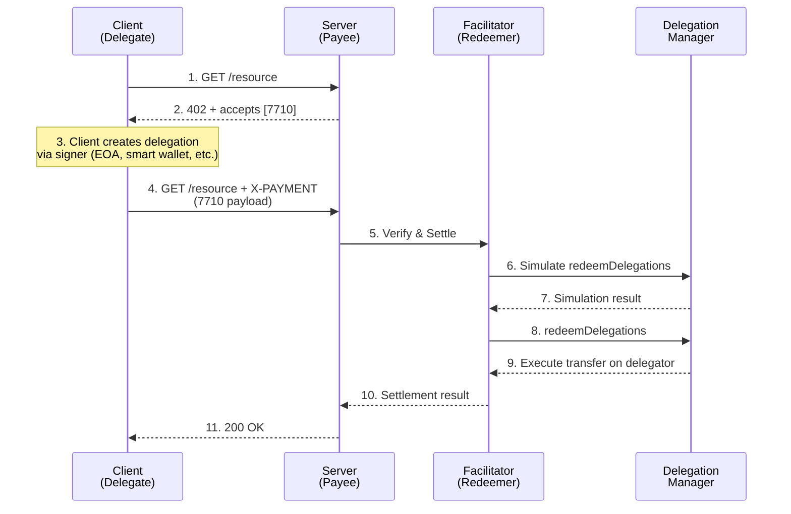

# x402 Wire Protocol Extension: ERC-7710 Delegation Scheme

## Specification Document

**Version:** 2.0
**Status:** Draft
**Scheme Identifier:** `7710`
**Extends:** x402 Protocol v2

---

## Table of Contents

1. [Summary](#summary)
2. [Motivation](#motivation)
3. [Scheme Overview](#scheme-overview)
4. [Payment Requirements Format](#payment-requirements-format)
5. [PaymentPayload Structure](#paymentpayload-structure)
6. [Verification Process](#verification-process)
7. [Settlement Process](#settlement-process)
8. [Security Considerations](#security-considerations)
9. [Appendix](#appendix)

---

## Summary

The `7710` scheme extends the x402 protocol to support ERC-7710 smart contract delegations. Unlike the `exact` scheme which uses EIP-3009's `transferWithAuthorization`, this scheme leverages delegated capabilities through a Delegation Manager contract, which is any contract that exposes the `redeemDelegations` method and is able to initiate internal messages on behalf of the user's account. This enables payments from smart contract accounts (including ERC-4337 accounts, other smart accounts, multi-sig wallets, and even EOAs via EIP-7002) in tokens that may not support EIP-3009, but do support ERC-7710 delegations.

These delegations may have additional user-defined policies, and can be issued by signers other than the account's primary key.

**Key Differences from `exact` Scheme:**

| Aspect | `exact` (EIP-3009) | `7710` (ERC-7710) |
|--------|-------------------|-------------------|
| Payer Type | Only in EIP-3009 compatible tokens | From any ERC-7710 compatible account |
| Authorization | `transferWithAuthorization` signature | Delegation + Delegation Manager address ("permission context") |
| Execution | Performed by sender first | Recipient performs via Delegation Manager |
| Payer | Must hold funds | Can themselves be paying on behalf of another account via a policy |
| Response Latency | Must wait for blockchain confirmation | Optimistic servers can respond immediately after simulation |

---

## Motivation

### Limitations of EIP-3009

The `exact` scheme relies on EIP-3009's `transferWithAuthorization`, which has the following limitations:

1. **Token-Specific**: Only works with tokens implementing EIP-3009 (primarily USDC)
2. **Holder-Only**: Can only be paid from an account holding funds, requiring lock-up per agent making requests.

### Benefits of ERC-7710 Delegations

1. **Flexible Authorization**: Supports complex delegation policies and caveats
2. **Reusable Sessions**: Enables long-lived payment sessions with bounded permissions
3. **AI Agent Friendly**: Designed for scenarios where multiple levels of automated systems need bounded payment authority
4. **Lower Latency**: Since the facilitator controls execution, optimistic servers can respond immediately after successful simulation without waiting for blockchain confirmation—only as fast as the facilitator's confidence requires.

---

## Scheme Overview

### Architecture



### Key Components

1. **Delegator**: The smart contract account that holds funds and authorizes the delegation
2. **Client**: The entity that creates the delegation (via its signer) and submits it for payment
3. **Delegation Manager**: Contract implementing `ERC7710Manager` that validates and executes delegations
4. **Facilitator**: x402 facilitator that acts as the redeemer, calling `redeemDelegations`
5. **Permission Context**: Encoded proof of delegation authority

### Flow Notes

The flow above shows the facilitator simulating and executing settlement **before** the server responds to the client. This differs from the `exact` scheme where the client must first submit a signed authorization that the facilitator then provides the proof to the recipient.

**Optimistic Response Pattern**: Since the facilitator controls execution and simulation provides strong guarantees, an optimistic server MAY respond to the client immediatelya after successful simulation (step 7) without waiting for the on-chain settlement to complete (steps 8-9). This enables response latencies limited only by simulation speed rather than blockchain confirmation times. The server assumes the risk that settlement may fail after responding, but simulation failures are rare when the delegation is valid.

---

## Payment Requirements Format

### 402 Response with 7710 Scheme

The server MAY offer the `7710` scheme alongside other schemes (like `exact`) to provide maximum client compatibility.

```http
HTTP/1.1 402 Payment Required
X-PAYMENT-REQUIRED: <base64-encoded-json>
Content-Type: application/json
```

**Decoded JSON Payload:**

```json
{
  "x402Version": 2,
  "error": null,
  "resource": {
    "url": "https://api.example.com/resource",
    "description": "Access to premium API endpoint",
    "mimeType": "application/json"
  },
  "accepts": [
    {
      "scheme": "7710",
      "network": "eip155:8453",
      "amount": "1000000",
      "payTo": "0x1234567890abcdef1234567890abcdef12345678",
      "maxTimeoutSeconds": 300,
      "asset": "0x833589fCD6eDb6E08f4c7C32D4f71b54bdA02913",
      "extra": {
        "name": "Premium API Access"
      }
    }
  ],
  "extensions": {}
}
```

### PaymentRequirements Fields for 7710 Scheme

Each `PaymentRequirements` object in the `accepts` array contains:

| Field | Type | Required | Description |
|-------|------|----------|-------------|
| `scheme` | string | Yes | Must be `"7710"` |
| `network` | string | Yes | Blockchain network identifier in CAIP-2 format (e.g., `"eip155:8453"`) |
| `amount` | string | Yes | Required payment amount in atomic token units |
| `payTo` | string | Yes | Recipient address for the payment |
| `maxTimeoutSeconds` | integer | Yes | Payment validity window in seconds |
| `asset` | string | Yes | Token contract address |
| `extra` | object | No | Scheme-specific additional information |

The `ResourceInfo` object contains:

| Field | Type | Required | Description |
|-------|------|----------|-------------|
| `url` | string | Yes | URL of the protected resource |
| `description` | string | No | Human-readable description of the resource |
| `mimeType` | string | No | MIME type of the expected response |

---

## PaymentPayload Structure

### Overview

The `PaymentPayload` for the 7710 scheme follows the x402 v2 structure with a scheme-specific `payload` field.

```json
{
  "x402Version": 2,
  "resource": {
    "url": "https://api.example.com/resource",
    "description": "Access to premium API endpoint",
    "mimeType": "application/json"
  },
  "accepted": {
    "scheme": "7710",
    "network": "eip155:8453",
    "amount": "1000000",
    "payTo": "0x209693Bc6afc0C5328bA36FaF03C514EF312287C",
    "maxTimeoutSeconds": 300,
    "asset": "0x833589fCD6eDb6E08f4c7C32D4f71b54bdA02913",
    "extra": {
      "name": "Premium API Access"
    }
  },
  "payload": {
    "delegationManager": "0xDelegationManagerAddress...",
    "permissionContext": "0x...",
    "authorization": {
      "from": "0xDelegatorAddress...",
      "to": "0xRecipientAddress...",
      "value": "1000000",
      "validAfter": "1699900000",
      "validBefore": "1699900300"
    }
  },
  "extensions": {}
}
```

### Payload Fields

| Field | Type | Required | Description |
|-------|------|----------|-------------|
| `delegationManager` | string | Yes | Address of the ERC-7710 Delegation Manager contract |
| `permissionContext` | string | Yes | Encoded delegation authority (hex-encoded bytes) |
| `authorization.from` | string | Yes | Address of the delegator (payer's smart account) |
| `authorization.to` | string | Yes | Address of the recipient (must match `payTo`) |
| `authorization.value` | string | Yes | Payment amount in base units |
| `authorization.validAfter` | string | No | Unix timestamp after which the payment is valid |
| `authorization.validBefore` | string | No | Unix timestamp before which the payment is valid |

### Optional Time Bounds

The `validAfter` and `validBefore` fields are optional. When omitted:

- **`validAfter` omitted**: Payment is valid immediately (equivalent to `0`)
- **`validBefore` omitted**: Payment has no explicit expiration (validity determined by delegation caveats or `maxTimeoutSeconds`)

When provided, these fields allow the client to further constrain the payment window within the bounds allowed by the delegation.

### Full PaymentPayload Example

**With time bounds:**

```json
{
  "x402Version": 2,
  "resource": {
    "url": "https://api.example.com/resource",
    "description": "Access to premium API endpoint",
    "mimeType": "application/json"
  },
  "accepted": {
    "scheme": "7710",
    "network": "eip155:8453",
    "amount": "1000000",
    "payTo": "0x209693Bc6afc0C5328bA36FaF03C514EF312287C",
    "maxTimeoutSeconds": 300,
    "asset": "0x833589fCD6eDb6E08f4c7C32D4f71b54bdA02913",
    "extra": {
      "name": "Premium API Access"
    }
  },
  "payload": {
    "delegationManager": "0x74Cb5e4eE81b86e70f9045036a1C5477de69eE87",
    "permissionContext": "0x000000000000000000000000857b06519e91e3a54538791bdbb0e22373e36b6600000000000000000000000023456789abcdef0123456789abcdef0123456789...",
    "authorization": {
      "from": "0x857b06519E91e3A54538791bDbb0E22373e36b66",
      "to": "0x209693Bc6afc0C5328bA36FaF03C514EF312287C",
      "value": "1000000",
      "validAfter": "1740672089",
      "validBefore": "1740672389"
    }
  },
  "extensions": {}
}
```

**Without time bounds (minimal payload):**

```json
{
  "x402Version": 2,
  "resource": {
    "url": "https://api.example.com/resource",
    "description": "Access to premium API endpoint",
    "mimeType": "application/json"
  },
  "accepted": {
    "scheme": "7710",
    "network": "eip155:8453",
    "amount": "1000000",
    "payTo": "0x209693Bc6afc0C5328bA36FaF03C514EF312287C",
    "maxTimeoutSeconds": 300,
    "asset": "0x833589fCD6eDb6E08f4c7C32D4f71b54bdA02913",
    "extra": {}
  },
  "payload": {
    "delegationManager": "0x74Cb5e4eE81b86e70f9045036a1C5477de69eE87",
    "permissionContext": "0x000000000000000000000000857b06519e91e3a54538791bdbb0e22373e36b66...",
    "authorization": {
      "from": "0x857b06519E91e3A54538791bDbb0E22373e36b66",
      "to": "0x209693Bc6afc0C5328bA36FaF03C514EF312287C",
      "value": "1000000"
    }
  },
  "extensions": {}
}
```

---

## Verification Process

The facilitator MUST perform the following verification steps for a `7710` scheme payment:

### Step 1: Basic Validation

```
1.1. Verify x402Version matches expected version (2)
1.2. Verify accepted.scheme is "7710"
1.3. Verify accepted.network matches the payment requirements (CAIP-2 format)
1.4. Verify payload.delegationManager is a valid address
```

### Step 2: Authorization Validation

```
2.1. Verify payload.authorization.to matches paymentRequirements.payTo
2.2. Verify payload.authorization.value >= paymentRequirements.amount
2.3. If validAfter is provided: verify current time >= validAfter
2.4. If validBefore is provided: verify current time < validBefore
2.5. If both time bounds provided: verify validBefore - validAfter <= paymentRequirements.maxTimeoutSeconds
```

### Step 3: Simulation

The facilitator MUST simulate the `redeemDelegations` call to ensure it would successfully transfer the required funds. This simulation-based approach validates the entire execution context without requiring the facilitator to understand the internal structure of the `permissionContext`.

```solidity
// Construct the execution calldata for ERC-20 transfer
bytes memory transferCalldata = abi.encodeWithSelector(
    IERC20.transfer.selector,
    authorization.to,
    authorization.value
);

// Encode as single call (mode = 0x00)
bytes32 mode = bytes32(0);
bytes memory executionCallData = abi.encodePacked(
    asset,           // target: token contract
    uint256(0),      // value: 0 (no ETH)
    transferCalldata // data: transfer call
);

// Simulate the redeemDelegations call
try delegationManager.redeemDelegations(
    [permissionContext],
    [mode],
    [executionCallData]
) {
    // Verify the transfer would result in correct balance change
    // by checking expected post-simulation balances
    return (true, "");
} catch (bytes memory errorData) {
    return (false, errorData);
}
```

### Simulation Validation

The simulation MUST verify that executing `redeemDelegations` would result in:

1. The `payTo` address receiving at least `amount` of the specified `asset`
2. The funds originating from the `authorization.from` address (the delegator)

### Verification Response

The verification response follows the standard x402 v2 `VerifyResponse` schema.

**Success:**

```json
{
  "isValid": true,
  "payer": "0x857b06519E91e3A54538791bDbb0E22373e36b66"
}
```

**Failure:**

```json
{
  "isValid": false,
  "invalidReason": "delegation_manager_error",
  "payer": "0x857b06519E91e3A54538791bDbb0E22373e36b66"
}
```

---

## Settlement Process

Settlement is performed by the facilitator executing the `redeemDelegations` call on the Delegation Manager contract.

### Settlement Steps

1. **Construct execution calldata**: Build the ERC-20 `transfer` call to transfer funds from the delegator to the `payTo` address
2. **Execute `redeemDelegations`**: Call the Delegation Manager with the `permissionContext`, execution mode, and calldata
3. **Verify transfer success**: Confirm the on-chain transaction completed successfully
4. **Return settlement response**: Provide transaction hash and status

### Settlement Response

The settlement response follows the standard x402 v2 `SettleResponse` schema.

**Success:**

```json
{
  "success": true,
  "payer": "0x857b06519E91e3A54538791bDbb0E22373e36b66",
  "transaction": "0x1234567890abcdef1234567890abcdef1234567890abcdef1234567890abcdef",
  "network": "eip155:8453"
}
```

**Failure:**

```json
{
  "success": false,
  "errorReason": "delegation_execution_failed",
  "payer": "0x857b06519E91e3A54538791bDbb0E22373e36b66",
  "transaction": "",
  "network": "eip155:8453"
}
```

---

## Security Considerations

### Delegation Scope

- The `permissionContext` encodes the full delegation and any user-defined policies
- Facilitators do not need to attempt to parse or validate the `permissionContext` internally, since its form is defined by the user's own account contract; instead rely on simulation
- Delegations may include spending limits, time bounds, or other constraints enforced by the Delegation Manager

### Replay Protection

- Each delegation execution is tracked by the Delegation Manager contract
- Time bounds (`validAfter`, `validBefore`) provide additional replay protection
- Nonces or execution counts may be enforced by delegation caveats

### Trust Model

- The facilitator MUST be trusted/self-hosted to execute the delegation correctly and report settled payments correctly.
- The Delegation Manager contract enforces all delegation constraints on-chain, and so MUST be trusted by the granting user.

---

## Appendix

### ERC-7710 Reference

ERC-7710 defines a standard interface for delegation managers that enable smart contract accounts to delegate specific capabilities to other addresses. Key concepts:

- **Delegator**: The account granting permission (typically a smart wallet)
- **Delegate**: The account receiving permission (the client submitting the payment)
- **Delegation Manager**: Contract that validates and executes delegated actions
- **Permission Context**: Encoded proof of delegation authority
