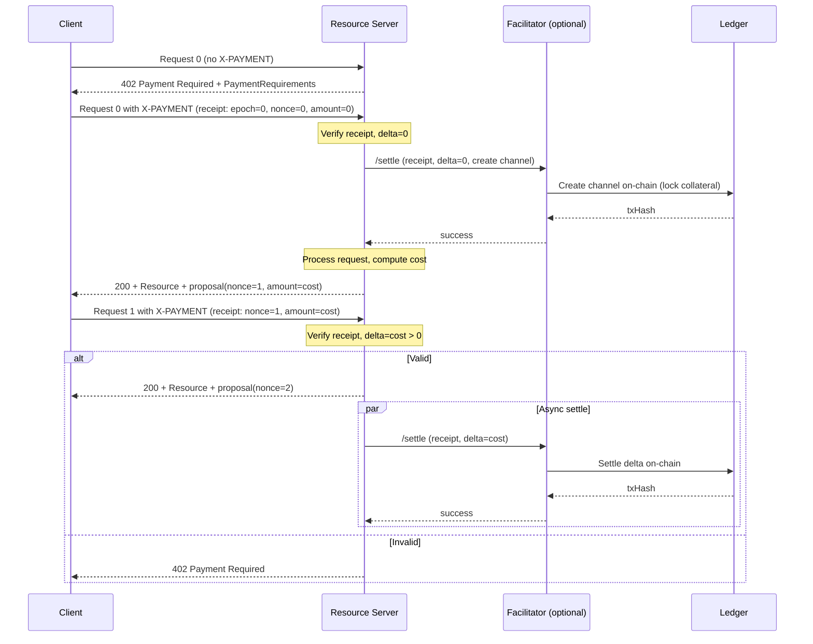

# Scheme: `channel` (ledger-agnostic payment channel receipts)

Status: normative core; bindings are informational and evolve independently.

## 1. Summary and scope

The `channel` scheme defines a chain-agnostic way to authorize payments via off-chain, signed receipts for a unidirectional payment channel. Each request carries a verifiable receipt that advances a running total for a given sub-stream (sub-channel). Resource servers can verify receipts immediately and defer on-ledger settlement, enabling high-frequency, usage-based monetization with low request latency.

Scope and non-goals:
- This document is the normative core (transport-agnostic, ledger-agnostic). Network-specific rules (identity, units, settlement entrypoints) are defined by bindings.
- Complements `exact`: `exact` targets fixed-amount immediate settlement; `channel` targets streaming/usage-based microtransactions with asynchronous settlement.

Roles:
- Client (payer)
- Resource Server (pricing authority)
- Facilitator (optional; verifies/settles, pays gas)
- Ledger (on-chain settlement)

## 2. How it works (normative)

The channel scheme follows a simple postpaid cycle:

1. **Discovery**: Client requests a resource without payment. Server responds `402 Payment Required` with requirements (`scheme: "channel"`, network, asset, payee).
2. **First request (lazy open)**: Client constructs and signs a receipt with `(epoch=0, nonce=0, accumulatedAmount=0)` and retries. Server verifies the receipt and triggers on-chain channel creation (facilitator pays gas, no funds transferred yet). Server processes the request, computes cost, and returns the resource with an unsigned proposal for the next receipt.
3. **Subsequent requests**: Client signs the proposal and includes it in the next request. Server verifies signature and monotonicity, updates off-chain state, and may trigger asynchronous settlement. Server returns the next proposal.

The pattern enables high-frequency requests with deferred settlement: receipts are verified immediately off-chain; actual on-chain transfers happen asynchronously in batches.



## 3. Core concepts (normative)

- **Channel**: Unidirectional payer→payee relation for one specific asset. Identified by `channelId`.
  - Each channel is bound to a specific asset at creation time.
  - The asset type is part of the channel identity: `channelId` uniquely represents the `(payer, payee, asset)` tuple.
  - To use multiple assets between the same payer/payee, open separate channels per asset.
  
- **Sub-channel** (`subChannelId`): Logical concurrent stream under the same channel. Each sub-channel maintains its own `nonce` and `accumulatedAmount` (both monotonic). Use distinct `subChannelId` per device/session/app to avoid nonce conflicts.

- **Epoch**: Channel lifecycle version, starting at `0` for the first open. Increments on close. Receipts from older epochs are invalid.

- **Receipt**: A signed payment commitment containing `channelId`, `epoch`, `subChannelId`, `accumulatedAmount`, `nonce`, and signature. All receipts follow the same structure; behavior is determined by the receipt's values and current channel state.

- **Proposal**: An unsigned receipt generated by the server, containing the next `nonce` and `accumulatedAmount` values based on current state and computed cost. The client signs the proposal to create the next receipt.

- **Delta**: The incremental payment amount computed as `delta = accumulatedAmount - lastAcceptedAmount`:
  - `delta = 0`: No settlement (idempotent retry or channel initialization)
  - `delta > 0`: Settlement required (transfer funds on-chain)

State management details (off-chain vs on-chain naming) are provided in Appendix A.

## 4. Data model (header, payload, receipt) (normative)

`X-PAYMENT` header fields follow x402 core; the `payload` contains a channel receipt object:

Payload fields:
- `version` (number): Receipt transport version for forward-compatibility.
- `payerId` (string): Payer identifier (binding-defined: DID/address/key reference).
- `clientTxRef` (string, optional): Client idempotency/correlation reference.
- `receipt` (object): Signed channel receipt with fields:
  - `channelId` (string): The channel identifier. The asset type is implicitly bound to `channelId` and is not repeated in the receipt.
  - `epoch` (number|string): Channel epoch.
  - `subChannelId` (string): Logical stream identifier.
  - `accumulatedAmount` (string): Total accumulated amount for this sub-channel in the channel's asset base units. Monotonic non-decreasing.
  - `nonce` (number|string): Monotonic per sub-channel within the same epoch.
  - `payeeId` (string): Payee identifier (binding-defined).
  - `chainId` (string|number, optional): Network identifier for cross-chain replay protection.
    - Required for bindings using in-band domain separation (e.g., Rooch BCS signing).
    - Not required for bindings using out-of-band domain separation (e.g., EVM EIP-712 domain `chainId`).
  - `payerSignature` (string): Signature over the canonical receipt, per binding.

Example (transport):

```json
{
  "x402Version": 1,
  "scheme": "channel",
  "network": "rooch-testnet",
  "payload": {
    "version": 1,
    "payerId": "did:rooch:0x123...",
    "clientTxRef": "c-20251027-0002",
    "receipt": {
      "channelId": "0xabc123...",
      "epoch": 3,
      "subChannelId": "device-1",
      "accumulatedAmount": "1234567890",  
      "nonce": 42,                         
      "payeeId": "did:rooch:0xdef456...",
      "payerSignature": "0x..."
    }
  }
}
```

JSON Schema: A machine-validated schema for `payload.receipt` is provided at [channel.receipt.schema.json](./channel.receipt.schema.json).

Notes:
- The asset type MUST NOT appear inside `receipt`; it is bound to `channelId` and validated via channel state.
- Some bindings include a `version` inside the canonical signed struct (e.g., Rooch binding uses a versioned struct). When both transport `payload.version` and `receipt.version` are present, implementations SHOULD keep them consistent.
- The first receipt typically has values `(epoch=0, nonce=0, accumulatedAmount=0)` and is used for lazy channel initialization. It has `delta=0`, so no funds are transferred—only the channel is created on-chain.

## 5. State machine and invariants (normative)

Invariants:
- Off-chain acceptance: `nonce` and `accumulatedAmount` MUST be non-decreasing per `(channelId, epoch, subChannelId)`.
- On-chain settlement: `nonce` MUST be strictly greater than `onChainConfirmedNonce` and `delta = accumulatedAmount - onChainConfirmedAmount` MUST be positive.
- Asset binding: Verifiers MUST ensure the channel's asset type matches `PaymentRequirements.asset` by querying channel state.

State transitions (high level):
- Receipt acceptance (off-chain): verify signature + monotonicity + budget → update off-chain state
- Settlement decision: if `delta > 0` → settle (on-ledger transfer); if `delta = 0` → no-op (idempotent or channel initialization)
- Settlement execution: submit receipt to ledger → transfer delta → update on-chain state → confirm

## 6. Security considerations (normative)

- Replay protection: Enforce monotonic `nonce` per `(channelId, epoch, subChannelId)`; off-chain accepts equality as idempotent; on-chain requires strictly increasing `nonce` and positive `delta`.
- Cross-chain replay: Bindings MUST include network/chain identifiers in signature scope. In-band (e.g., Rooch) include `chainId` inside the signed receipt; out-of-band (EVM) use domain `chainId`.
- Asset binding: Asset is implicitly bound to `channelId`; verifiers MUST validate asset via channel state matches `PaymentRequirements.asset`.
- Authorization scope: Verify `payeeId`/`payTo` align with advertised requirements.
- Concurrency: Sub-channels isolate concurrency; avoid cross-stream nonce interference.
- Settlement failures: Handle insufficient collateral or closed channels; include `clientTxRef` for idempotent retries.

## 7. Bindings and compatibility (informational pointers)

Bindings define identity resolution, unit semantics, canonical signing form, and settlement entrypoints:
- Rooch binding: see `./scheme_channel_rooch.md`
- EVM binding: see `./scheme_channel_evm.md`

Note on `chainId`:
- Rooch (in-band domain separation): `chainId` MUST be included in the signed receipt.
- EVM (EIP-712 domain separation): `chainId` MUST be in the domain; it is not repeated inside the receipt.

## 8. Glossary (informational)

- **proposal**: An unsigned receipt generated by the server, containing the next epoch, nonce, and accumulatedAmount values based on current channel state and computed cost. The client signs the proposal to create a signed receipt for the next request.
  - Also called: unsigned receipt
  - Note: Some bindings use specific terminology for their signed structures (e.g., Rooch uses "SubRAV" for the Move struct). These are binding-specific implementation details.

- **receipt**: A signed payment commitment containing channelId, epoch, subChannelId, accumulatedAmount, nonce, and signature. All receipts follow the same structure and verification rules; behavior is determined by the receipt's values and current channel state, not by artificial type distinctions.
  - The first receipt for a channel typically has `(epoch=0, nonce=0, accumulatedAmount=0)` and is used for lazy channel initialization.
  - Subsequent receipts have increasing nonce and accumulatedAmount values representing accumulated payment.

- **subChannelId**: Logical stream identifier under a channel. In DID-based bindings, it often equals the DID verification method fragment without the leading `#` (e.g., `#key-1` → `key-1`).

- **delta**: The incremental payment amount computed as `accumulatedAmount - lastAcceptedAmount`. Determines settlement behavior:
  - `delta = 0`: No settlement (idempotent retry or channel initialization)
  - `delta > 0`: Settlement required (transfer funds on-chain)

---

## Appendix A: State management details (normative)

State naming (single source of truth):
- **offChainLastAcceptedNonce / offChainLastAcceptedAmount**: Latest receipt state the facilitator/server has accepted and stored off-chain for a given `(channelId, epoch, subChannelId)`.
- **onChainConfirmedNonce / onChainConfirmedAmount**: Latest state recorded on-chain after settlement.
- Invariant: `onChainConfirmed* ≤ offChainLastAccepted*`.

## Appendix B: Verification protocol (normative)

Inputs: `network`, `PaymentRequirements`, `X-PAYMENT`.

Steps:

1) Signature validation
- Resolve `payerId` as per binding and verify `payerSignature` over the canonical receipt.

2) Channel state check
- Derive or extract `channelId` from the receipt.
- Query channel state:
  - If channel does NOT exist: prepare to create channel on-chain via settlement (lazy open); proceed to next steps.
  - If channel exists: verify `epoch` matches the channel's current epoch. Epoch mismatch → reject.

3) Replay protection and monotonicity
- Retrieve off-chain state for `(channelId, epoch, subChannelId)`.
- Enforce non-decreasing `nonce` and `accumulatedAmount`.
- Equality is allowed (idempotent retry) and MUST be treated as a no-op: return success without state advancement.

4) Delta computation and budget
- Compute `delta = accumulatedAmount - offChainLastAcceptedAmount`.
  - For new sub-channels, treat `offChainLastAcceptedAmount = 0` and `offChainLastAcceptedNonce = 0`.
- Validate `0 ≤ delta ≤ paymentRequirements.maxAmountRequired`.
- Special cases:
  - If `delta = 0`: accept as idempotent retry or initialization receipt; DO NOT trigger settlement.
  - If `delta > 0`: accept and prepare for settlement.

5) Asset/network consistency
- Check `network`, asset and units against binding and `paymentRequirements`.

6) Optional dry-run
- If supported by the binding, simulate settlement to detect closed channels or insufficient collateral before accepting.

Acceptance verdict:
- Return a boolean verdict and reason in `/verify` responses, consistent with x402.

Note on idempotency: 
- Off-chain: equal `(nonce, accumulatedAmount)` MUST be treated as success with no state advancement and MUST NOT trigger settlement.
- On-chain: settlement entrypoints MUST require strictly increasing `nonce` and positive `delta > 0`.

## Appendix C: Settlement specification (normative)

Unified settlement entrypoint (binding-defined, e.g., `apply_receipt`) SHOULD:
- Accept any valid receipt with verified signature and matching epoch.
- Determine settlement behavior based on channel state and delta:
  - If channel does NOT exist: create channel on-chain, initializing `epoch=0`, `lastConfirmedNonce=0`, `lastConfirmedAmount=0`. This locks the required collateral/deposit. No funds are transferred (delta=0 for initialization receipt).
  - If channel exists:
    - Verify epoch matches; reject if mismatch.
    - Enforce on-chain `nonce` strictly increasing: `nonce > lastConfirmedNonce`.
    - Compute `delta = accumulatedAmount - lastConfirmedAmount`; enforce `delta > 0`.
    - Settle the `delta`: transfer from payer to payee.
    - Update on-chain state: `lastConfirmedNonce := nonce`, `lastConfirmedAmount := accumulatedAmount`.
- Idempotency: If `(nonce, accumulatedAmount)` match existing on-chain state, treat as idempotent retry with no re-execution.

Settlement modes:
- Deferred/Batching: aggregate receipts across sub-channels when permitted by the binding.
- Single receipt: settle immediately when needed.
- Response shape: `{ success, error?, txHash?, network }` as per x402.

## Appendix D: Detailed interaction flows (informational)

First request (lazy channel open):
1. Initial discovery: Client sends request without a receipt. Server responds `402 Payment Required` with standard `PaymentRequirements`:
   - `scheme: "channel"`, `network: "<network-slug>"`, `payTo`, `asset`, `maxAmountRequired`, etc.
2. Client constructs first receipt from requirements:
   - Derive `channelId` from `(payerId, payeeId, asset)` per binding; set `epoch=0`, `nonce=0`, `accumulatedAmount=0`; choose `subChannelId`; sign per binding.
3. Client retries with `X-PAYMENT { receipt }`.
4. Server/facilitator processes the receipt:
   - Verify signature, check channel state (doesn't exist → lazy open).
   - Compute `delta = 0 - 0 = 0` → no settlement, but trigger channel creation on-chain via settlement entrypoint (facilitator pays gas).
   - Settlement creates channel with `epoch=0`, `lastConfirmedNonce=0`, `lastConfirmedAmount=0`. This locks the required collateral/deposit on-chain.
   - Process the request, compute actual service cost, and return `200 + resource` with unsigned proposal (`epoch=0`, `nonce=1`, `accumulatedAmount=<cost>`).
5. Client signs the proposal and includes it in Request N+1.

Regular N/N+1 cycle:
- Request N+1 carries the signed receipt for N. Server verifies signature + monotonicity + budget, computes `delta`, advances off-chain state.
- If `delta > 0`: may trigger settlement (asynchronous/batched) via facilitator.
- Server returns next unsigned proposal in the response.

Facilitator-assisted proposal generation (optional):
- Stateless servers MAY delegate proposal construction to a facilitator using the current off-chain context; the server remains the pricing authority. The facilitator MUST NOT inflate `serverComputedDelta` and MAY enforce policy (e.g., cap by `maxAmountRequired`). Include `clientTxRef` for idempotency.

Streaming/SSE notes:
- Proposals may be emitted in-band per chunk/frame; clients sign and attach the next receipt in subsequent requests or frames per application protocol.

