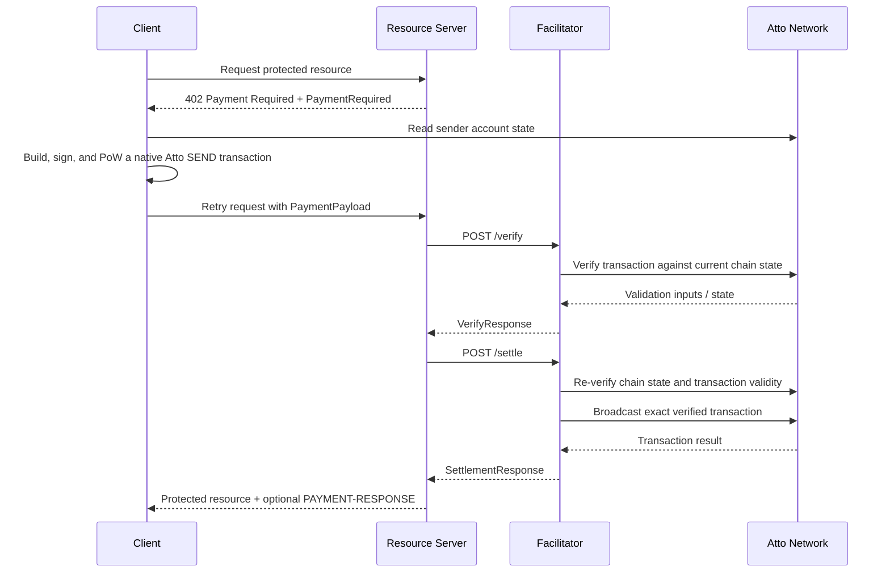

# Scheme: `exact` on `Atto`

## Versions supported

- ❌ `v1`
- ✅ `v2`

## Supported Networks

This spec uses [CAIP-2](https://chainagnostic.org/CAIPs/caip-2) network identifiers (namespace
registration: [ChainAgnostic/namespaces#178](https://github.com/ChainAgnostic/namespaces/pull/178)):

- `atto:live` — Atto mainnet
- `atto:beta` — Atto beta / testnet
- `atto:dev` — Atto devnet
- `atto:local` — local / private development network

## Summary

The x402 `exact` scheme on Atto uses a fully signed native Atto `SEND` transaction to transfer an exact amount of the
native Atto asset from the client to the recipient specified by the resource server.

Atto is a feeless account-chain network. Instead of paying gas fees, the client computes a lightweight proof-of-work (
PoW) nonce. The payment payload therefore consists of a signed Atto transaction, not a facilitator-constructed
transaction.

## Protocol Flow



1. **Client** makes a request to a **Resource Server**.
2. **Resource Server** responds with `402 Payment Required` and a `PaymentRequired` challenge.
3. **Client** obtains the latest sender account state from an Atto node or other trusted state source.
4. **Client** constructs a native Atto `SEND` transaction that transfers the exact required amount to `payTo`.
5. **Client** signs the transaction and computes the required PoW.
6. **Client** sends a new request to the resource server with the `PaymentPayload` containing the base64-encoded
   transaction.
7. **Resource Server** forwards the `PaymentPayload` and `PaymentRequirements` to the **Facilitator** `/verify`
   endpoint, or verifies directly if it performs facilitator duties itself.
8. **Facilitator** verifies x402-level requirements, transaction validity, recipient binding, amount exactness,
   sender-chain consistency, and PoW.
9. **Resource Server**, upon successful verification, forwards the payload to the facilitator's `/settle` endpoint, or
   settles directly.
10. **Facilitator** settles by broadcasting the exact verified Atto transaction to the Atto network.
11. **Resource Server** grants the **Client** access to the resource upon successful settlement.

> [!NOTE]
> `/settle` MUST perform full verification independently and MUST NOT assume prior `/verify` success.

## `PaymentRequirements` for `exact`

The `exact` scheme on Atto uses the standard x402 `PaymentRequirements` object.

Example:

```json
{
  "scheme": "exact",
  "network": "atto:live",
  "amount": "500000000",
  "asset": "atto",
  "payTo": "atto://abzekkyvhsos74rfeibubjifbjdzy3bi7habx5o3kt4ot2vcl5uhb2rcrn7hu",
  "maxTimeoutSeconds": 60,
  "extra": {}
}
```

**Field Definitions:**

- `scheme` MUST be `"exact"`
- `network` MUST be an agreed Atto network identifier such as `atto:live`
- `amount` MUST be the exact required amount in raw Atto units
- `asset` MUST identify the transferred asset; `"atto"` is RECOMMENDED
- `payTo` MUST be the recipient Atto address in canonical `atto://` format
- `maxTimeoutSeconds` MUST define the maximum validity window accepted by the verifier
- `extra` MAY be present but is not required for Atto transaction validation

Because Atto transfers the native asset directly and does not use token contract addresses for this flow, this spec
RECOMMENDS the literal asset identifier `"atto"`. Verifiers MUST enforce asset equality as specified in the verification
rules.

## PaymentPayload `payload` Field

The `payload` field of the `PaymentPayload` contains:

```json
{
  "transaction": "BASE64_ENCODED_ATTO_TRANSACTION"
}
```

The `transaction` field contains a base64-encoded signed Atto `SEND` transaction.

**Full `PaymentPayload` object:**

```json
{
  "x402Version": 2,
  "resource": {
    "url": "https://api.example.com/premium-article",
    "description": "Access premium article",
    "mimeType": "application/json"
  },
  "accepted": {
    "scheme": "exact",
    "network": "atto:live",
    "amount": "500000000",
    "asset": "atto",
    "payTo": "atto://abzekkyvhsos74rfeibubjifbjdzy3bi7habx5o3kt4ot2vcl5uhb2rcrn7hu",
    "maxTimeoutSeconds": 60,
    "extra": {}
  },
  "payload": {
    "transaction": "BASE64_ENCODED_ATTO_TRANSACTION"
  }
}
```

## Transaction Requirements

For `exact` on Atto, the payment payload MUST contain a signed native Atto `SEND` transaction.

The verifier MUST decode and validate that transaction according to the Atto protocol rules for:

- transaction structure
- block hashing
- signature verification
- address decoding
- sender-chain consistency
- proof-of-work validation

The x402 scheme does not require re-specifying the full Atto serialization format. Implementations SHOULD follow the
Atto protocol documentation for native transaction construction and validation.

## Facilitator Verification Rules (MUST)

A facilitator verifying an `exact` scheme on Atto MUST enforce all of the following checks before accepting or settling
the transaction.

### 1. Protocol Validation

- `paymentPayload.x402Version` MUST be `2`
- `paymentPayload.accepted.scheme` and `paymentRequirements.scheme` MUST both be `"exact"`
- `paymentPayload.accepted.network` MUST equal `paymentRequirements.network`
- `paymentPayload.accepted.asset` MUST equal `paymentRequirements.asset`
- `paymentPayload.accepted.payTo` MUST equal `paymentRequirements.payTo`
- `paymentPayload.accepted.amount` MUST equal `paymentRequirements.amount` exactly

### 2. Transaction Decoding

- `payload.transaction` MUST be present
- `payload.transaction` MUST base64-decode successfully
- the decoded transaction MUST parse as a valid Atto `SEND` transaction

### 3. Transaction Validity

The verifier MUST reject the transaction if any of the following are true:

- the transaction is not a valid `SEND` transaction under Atto rules
- the encoded Atto network does not correspond to `accepted.network`
- the transaction version is unsupported
- the signing algorithm is unsupported
- the transaction is malformed

### 4. Signature Verification

The verifier MUST verify the transaction signature according to the Atto protocol rules using the sender public key.

If signature verification fails, the payment MUST be rejected.

### 5. Recipient Binding

The verifier MUST decode `accepted.payTo` using Atto address rules and reject the payment if the transaction recipient
does not exactly match the address specified by `accepted.payTo`.

### 6. Amount Exactness

The verifier MUST reject the payment unless the transaction amount is exactly equal to `paymentRequirements.amount`.

Underpayment and overpayment MUST both be rejected.

### 7. Account-Chain Consistency

The verifier MUST validate sender-chain state against a trusted Atto node or equivalent canonical state source.

At minimum, the verifier MUST confirm:

- the transaction uses the current valid sender chain position
- the referenced previous block matches the sender's current confirmed head
- the post-transaction balance is consistent with the required amount
- the sender has sufficient balance before the transfer

### 8. Timestamp Validity

The verifier MUST ensure the transaction timestamp is valid according to Atto protocol rules and local verifier policy.

At minimum, the verifier MUST ensure:

- the timestamp is not before the sender account's most recent confirmed transaction
- the timestamp is not more than 1 minute in the future relative to the verifier's clock
- the payment remains within the validity window implied by `maxTimeoutSeconds`

### 9. Proof-of-Work Verification

The verifier MUST validate the PoW nonce according to the Atto protocol rules.

For `SEND` transactions, the verifier MUST ensure the PoW is valid for the transaction's sender-chain position.

### 10. Replay Protection

The verifier MUST reject replayable, already-used, or conflicting payments.

At minimum, it MUST reject payments if any of the following are true:

- the exact transaction hash has already been accepted or settled
- another in-flight payment attempt for the same sender-chain position is already being processed
- the sender chain state already reflects this transaction
- the transaction no longer matches the sender's current chain state

For account-chain systems, implementations SHOULD treat the sender chain position as replay-sensitive during the
verification and settlement window. In practice, this means temporarily reserving the sender's current frontier, or
equivalent sender-chain position, so that competing payment attempts for the same chain position are rejected until the
ongoing attempt succeeds or expires.

> [!WARNING]
> The Atto node API for transaction submission is idempotent — re-submitting an already-confirmed transaction will
> succeed silently. Facilitators MUST track settled transaction hashes independently to detect duplicate settlements.

## Settlement Logic

Settlement is performed by broadcasting the exact verified Atto transaction to the Atto network.

The facilitator or resource server SHALL use the Atto synchronous submission API (`POST transactions/stream`). Because
the submission API expects a structured Atto transaction object rather than the encoded `payload.transaction` value
directly, the submitted transaction MUST remain semantically identical to the verified payment.

### `SettlementResponse`

Example success response:

```json
{
  "success": true,
  "transaction": "15601f3c70d7d27f104a7076db399be9123241a3ecce6e833b676720b4e1f43e",
  "network": "atto:live",
  "payer": "atto://payer-address"
}
```

Example failure response:

```json
{
  "success": false,
  "errorReason": "invalid_exact_atto_payload_signature",
  "transaction": "",
  "network": "atto:live"
}
```

- `transaction` — canonical Atto transaction or block hash
- `network` — the selected Atto network identifier
- `payer` — canonical payer Atto address

## Recommended Error Reasons

Implementations SHOULD use stable machine-readable reasons. The following are RECOMMENDED:

- `invalid_network`
- `invalid_payload`
- `invalid_payment_requirements`
- `invalid_atto_payload_signature`
- `invalid_atto_payload_pow`
- `invalid_atto_payload_amount_mismatch`
- `invalid_atto_payload_recipient_mismatch`
- `invalid_atto_payload_timestamp`
- `invalid_atto_payload_chain_state`
- `insufficient_funds`
- `duplicate_settlement`
- `unexpected_verify_error`
- `unexpected_settle_error`

## Security Considerations

### Recipient integrity

The verifier MUST derive the recipient from `payTo` and compare it directly to the native transaction.

### Amount integrity

The verifier MUST enforce exact equality between the native transaction amount and `paymentRequirements.amount`.

### Replay resistance

The verifier MUST treat the sender-chain position and transaction hash as replay-sensitive identifiers.

### State race conditions

Because Atto is account-chain based, verification SHOULD occur as close as possible to settlement time. Stale
transactions that no longer match current sender account state MUST be rejected.

## Appendix

### Atto Address Format

Atto addresses are native addresses prefixed with `atto://`. They encode the account identity using Atto's address
format and checksum rules.

At a high level, an Atto address encodes:

- the account algorithm identifier
- the account public key
- a 5-byte checksum

Implementations MUST validate addresses according to the Atto protocol documentation before using them for recipient
binding.

### Atto Protocol References

The following references are provided as an implementation convenience and may change over time:

- Atto Integration Guide: `https://atto.cash/docs/integration`
- Atto Offline-Signing Reference: `https://atto.cash/docs/integration/advanced/protocol-offline-signing-reference`
