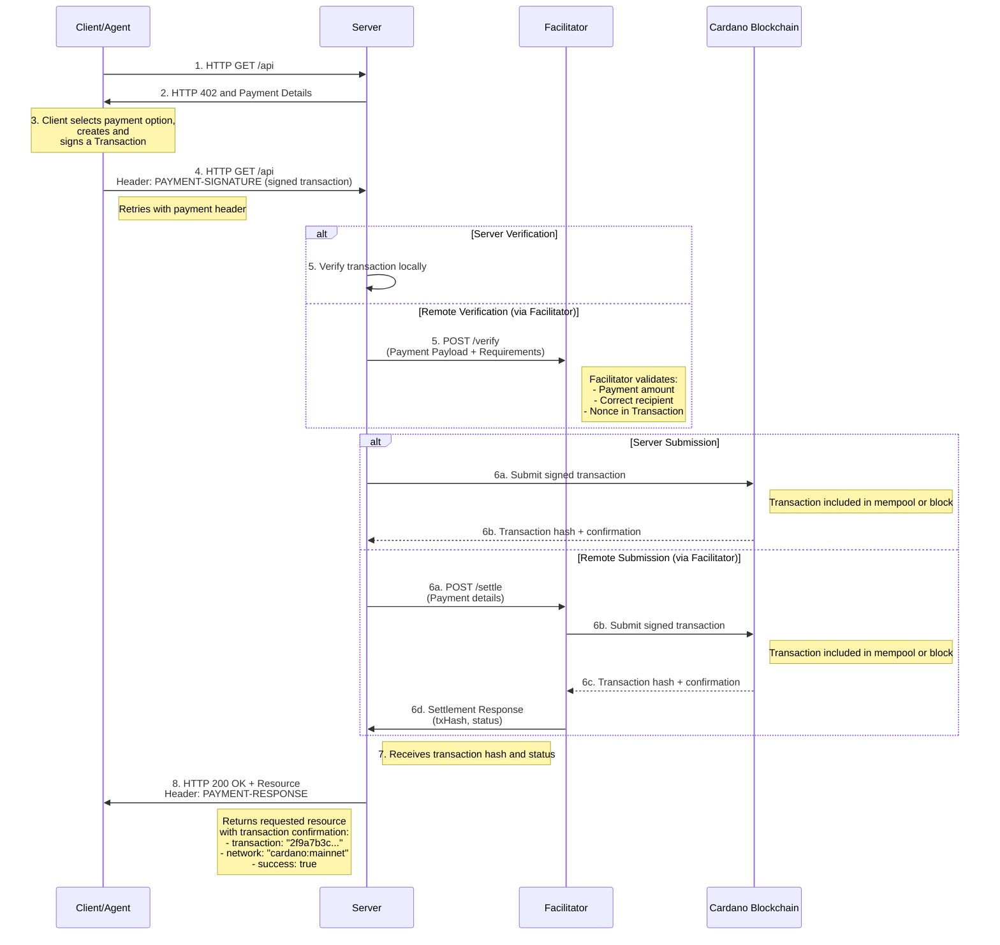

# Scheme: exact on Cardano

## Summary

This document specifies the `exact` payment scheme for the x402 protocol on Cardano. This scheme facilitates payments of Cardano Native Tokens.

It offers different flavors to do x402 interactions:

1. Doing **Address-To-Address** Payments, similar to the regular x402 specifications on other chains.

2. Using the **Masumi Smart Protocol**, which offers additional refund mechanics & decision logging mechanisms in a decentralised way.

3. Performing payments to scripts using parameters that can be applied to scripts while transaction building.
## Protocol Flow



The protocol flow for `exact` on Cardano is client-driven. 

1.  **Client** makes an HTTP request to a **Resource Server**.

2.  **Resource Server** responds with a `402 Payment Required` status, detailing the payment information:
    - If using the Masumi Protocol, the `extra` field will contain additional information required to build a Masumi Smart Contract interaction.
    - If using Address-To-Address payments, the `payTo` field will contain the address to which the payment must be sent.
    - If using Script payments, the `extra` field will contain parameters to be applied to scripts during transaction building.

3.  **Client** constructs the transaction body, signs it, and returns it to the **Resource Server** via the `PAYMENT-SIGNATURE` header.

4.  **Resource Server** verifies the transaction is valid:
    - **Local verification**: The server validates the transaction structure, amount, and recipient address directly.
    - **Remote verification**: The server forwards the `PAYMENT-SIGNATURE` header and `paymentRequirements` to a **Facilitator's** `/verify` endpoint to check if the transaction is valid.

5.  After successful verification, the signed transaction is submitted to the Cardano blockchain:
    - **Server submission**: The **Resource Server** submits the transaction directly to the Cardano blockchain.
    - **Facilitator submission**: The **Resource Server** sends the transaction to the **Facilitator's** `/settle` endpoint, which then submits it to the blockchain.

6.  The Cardano blockchain includes the transaction in the mempool or a block and returns the transaction hash and confirmation status.

7.  **Resource Server** receives the transaction hash and status:
    - If submitted via the **Facilitator**, it receives a settlement response containing the `txHash` and `status`.
    - If the **Facilitator** supports mempool monitoring, it may notify the **Resource Server** upon mempool inclusion, reducing end-to-end latency but with higher risk of accepting unconfirmed transactions.

8.  **Resource Server** grants the **Client** access to the requested resource, returning an HTTP 200 OK response with an `PAYMENT-RESPONSE` header containing:
    - `txHash`: The Cardano transaction hash
    - `network`: The Cardano network (e.g., `cardano:mainnet`)
    - `status`: The transaction status (e.g., `confirmed` or `mempool`)

### `PaymentRequirementsResponse`

#### Default Schema

When the Resource Server responds with a `402 Payment Required`, the body of the response contains the payment requirements in the following schema:

```js
{
  "x402Version": 2,
  "error": "PAYMENT-SIGNATURE header is required",
  "resource": {
    "url": "https://api.example.com/premium-data",
    "description": "Access to premium market data",
    "mimeType": "application/json"
  },
  "accepts": [
    {
      "scheme": "exact",
      "network": "cardano:mainnet", // cardano:preprod or cardano:preview for public testnets
      "maxAmountRequired": "10000", // 1 USDM = 1000000000
      "asset": "c48cbb3d5e57ed56e276bc45f99ab39abe94e6cd7ac39fb402da47ad.0014df105553444d", // ${policyId}.${assetName} The policy id in this example is the USDM policy id on Cardano Mainnet - use 16a55b2a349361ff88c03788f93e1e966e5d689605d044fef722ddde for USDM on Preprod. The asset name is the hex representation of '(333) USDM'
      "payTo": "addr1...",
      "maxTimeoutSeconds": 600, // Has to be set to a higher amount of time because of the Cardano Network speed
      "extra": {
        // In case of default address-to-address payments, this may be empty or contain additional metadata
      }
    }
  ]
}
```

#### Masumi Flavor Schema

When the Resource Server requires payment via the Masumi Smart Protocol, the `extra` field in the `PaymentRequirementsResponse` contains additional fields required for Masumi interactions.

```js
{
  "x402Version": 2,
  "error": "PAYMENT-SIGNATURE header is required",
  "resource": {
    "url": "https://api.example.com/premium-data",
    "description": "Access to premium market data",
    "mimeType": "application/json"
  },
  "accepts": [
    {
      "scheme": "exact",
      "network": "cardano:mainnet", // cardano:preprod or cardano:preview for public testnets
      "maxAmountRequired": "10000", // 1 USDM = 1000000000
      "asset": "c48cbb3d5e57ed56e276bc45f99ab39abe94e6cd7ac39fb402da47ad.0014df105553444d", // ${policyId}.${assetName} The policy id in this example is the USDM policy id on Cardano Mainnet - use 16a55b2a349361ff88c03788f93e1e966e5d689605d044fef722ddde for USDM on Preprod. The asset name is the hex representation of '(333) USDM'
      "payTo": "addr1...",
      "maxTimeoutSeconds": 600, // Has to be set to a higher amount of time because of the Cardano Network speed
      "extra": {
        "flavor": "masumi", // optional, can be "default" | "masumi" | "script"
        // If the masumi flavor is used, make sure to include all masumi related fields
        "identifierFromPurchaser": "aabbaabb11221122aabb",
        "network": "Mainnet | Preprod",
        "sellerVkey": "sdasdqweqwewewewqe",
        "paymentType": "Web3CardanoV1",
        "blockchainIdentifier": "blockchain_identifier",
        "payByTime": "1713626260",
        "submitResultTime": "1713636260",
        "unlockTime": "1713636260",
        "externalDisputeUnlockTime": "1713636260",
        "agentIdentifier": "agent_identifier",
        "inputHash": "9f86d081884c7d659a2feaa0c55ad015a3bf4f1b2b0b822cd15d6c15b0f00a08"
        // Additional fields for masumi or script flavors can be added here
      }
    }
  ]
}
```

#### Script Flavor Schema

When the Resource Server requires payment to a script, the `extra` field in the `PaymentRequirementsResponse` contains additional fields required for script interactions.

```js
{
  "x402Version": 2,
  "error": "PAYMENT-SIGNATURE header is required",
  "resource": {
    "url": "https://api.example.com/premium-data",
    "description": "Access to premium market data",
    "mimeType": "application/json"
  },
  "accepts": [
    {
      "scheme": "exact",
      "network": "cardano:mainnet", // cardano:preprod or cardano:preview for public testnets
      "maxAmountRequired": "10000", // 1 USDM = 1000000000
      "asset": "c48cbb3d5e57ed56e276bc45f99ab39abe94e6cd7ac39fb402da47ad.0014df105553444d", // ${policyId}.${assetName} The policy id in this example is the USDM policy id on Cardano Mainnet - use 16a55b2a349361ff88c03788f93e1e966e5d689605d044fef722ddde for USDM on Preprod. The asset name is the hex representation of '(333) USDM'
      "payTo": "addr1...", // In case of script payments, this is the script address (the address should match the script provided in extra after applying parameters. In case of additional parameters provided, the client needs to pass the additional parameters to the server in the PAYMENT-SIGNATURE header, so that the server can reconstruct the script address and verify the payment)
      "maxTimeoutSeconds": 600, // Has to be set to a higher amount of time because of the Cardano Network speed
      "extra": {
        "flavor": "script", // optional, can be "default" | "masumi" | "script"
        // If the script flavor is used, make sure to include all script related fields
        "scriptHash": "script_hash_here", // If the script is already on-chain, provide its hash and the client can resolve the full script
        "script": {
          // Optional full script object if not on-chain yet
          "type": "plutusV3",
          "code": "<Hex-encoded script code here>",
        },
        "parameters": {
          "param1": {"value": "Hello World", "type": "bytes"},
          "param2": {"value": 42, "type": "bigint"}
          // Script-specific parameters required for transaction building
        }
        // Additional fields for script flavors can be added here
      }
    }
  ]
}
```

### `PAYMENT-SIGNATURE` Header Payload

The PAYMENT-SIGNATURE header is base64-encoded and sent in the client's request to the resource server when paying for a resource.

The payload field of the PAYMENT-SIGNATURE header must contain the following fields:

transaction: The signed Cardano transaction (Base64 encoded).
Example:

```js
{
  "transaction": "AAAIAQDi1HwjSnS6M+WGvD73iEyUY2FRKNj0MlRp7+3SHZM3xCvMdB0AAAAAIFRgPKOstGBLCnbcyGoOXugUYAWwVzNrpMjPCzXK4KQWAQCMoE29VLGwftex8rhIlOuFLFNfxLIJlHqGXoXA8hx6l+LMdB0AAAAAIHbPucTRIEWgO6lzqukswPZ6i72IHEKK5LyM1l9HJNZNAQBthSeHDVK8Xr5/zp3JMZPLtG5uAoVgedTA4pEnp+h8qUlUzRwAAAAAIACH0swYW/QfGCFczGnjAVPHPqZrQE5vfvJr36i6KVEFAQAC7W4K5vCwB+nprjxcNlLiOQ7SIIfyCZjmj2qSis2iTsCuzBwAAAAAIAkSUkXOoeq52GNdhwpbs+jZqqrqPdmiN3oPw5EzDIanAQAIyFNGWD6OxiFIyXSxrNEcFG0npm+nImk6InUssXb1EZgx1hwAAAAAILhsjmMKyM0n75Cd7z6ufH2LNhOMibFOGhNlLgV5RFuEAQC+Mh4kGkLwrw/11729oUQnt3xOmOreE6PcnuN6M68ZBcCuzBwAAAAAIO2PQhSSqSAawCbRr005lfjBgFOqIHo4zb2GcQ/WCxAlAAgA+QKVAAAAAAAgjiAHD0X4HNSdVPpJtf2E6W2uRc8kbvCHYkgEQ1B+w1MDAwEAAAUBAQABAgABAwABBAABBQACAQAAAQEGAAEBAgEAAQcAHrfFfj8r0Pxsudz/0UPqlX5NmPgFw1hzP3be4GZ/4LEB5XXrONxGw0qOUsq3yNKeUhOCOgCIwaa4pswKaer66EKqPGwdAAAAACBrOIN4poutFUmHfB6FbFJu8GgXoPPTGQWREqFpPfvO1B63xX4/K9D8bLnc/9FD6pV+TZj4BcNYcz923uBmf+Cx7gIAAAAAAABg4xYAAAAAAAA="
}
```

Full PAYMENT-SIGNATURE header:

```js
{
  "x402Version": 2,
  "resource": {
    "url": "https://api.example.com/premium-data",
    "description": "Access to premium market data",
    "mimeType": "application/json"
  },
  "accepted": {
    "scheme": "exact",
    "network": "cardano:mainnet",
    "amount": "10000",
    "asset": "c48cbb3d5e57ed56e276bc45f99ab39abe94e6cd7ac39fb402da47ad.0014df105553444d",
    "payTo": "addr1...",
    "maxTimeoutSeconds": 600,
    "extra": {
      // In case of default address-to-address payments, this may be empty or contain additional metadata
    }
  },
  "payload": {
    "transaction": "AAAIAQDi1HwjSnS6M+WGvD73iEyUY2FRKNj0MlRp7+3SHZM3xCvMdB0AAAAAIFRgPKOstGBLCnbcyGoOXugUYAWwVzNrpMjPCzXK4KQWAQCMoE29VLGwftex8rhIlOuFLFNfxLIJlHqGXoXA8hx6l+LMdB0AAAAAIHbPucTRIEWgO6lzqukswPZ6i72IHEKK5LyM1l9HJNZNAQBthSeHDVK8Xr5/zp3JMZPLtG5uAoVgedTA4pEnp+h8qUlUzRwAAAAAIACH0swYW/QfGCFczGnjAVPHPqZrQE5vfvJr36i6KVEFAQAC7W4K5vCwB+nprjxcNlLiOQ7SIIfyCZjmj2qSis2iTsCuzBwAAAAAIAkSUkXOoeq52GNdhwpbs+jZqqrqPdmiN3oPw5EzDIanAQAIyFNGWD6OxiFIyXSxrNEcFG0npm+nImk6InUssXb1EZgx1hwAAAAAILhsjmMKyM0n75Cd7z6ufH2LNhOMibFOGhNlLgV5RFuEAQC+Mh4kGkLwrw/11729oUQnt3xOmOreE6PcnuN6M68ZBcCuzBwAAAAAIO2PQhSSqSAawCbRr005lfjBgFOqIHo4zb2GcQ/WCxAlAAgA+QKVAAAAAAAgjiAHD0X4HNSdVPpJtf2E6W2uRc8kbvCHYkgEQ1B+w1MDAwEAAAUBAQABAgABAwABBAABBQACAQAAAQEGAAEBAgEAAQcAHrfFfj8r0Pxsudz/0UPqlX5NmPgFw1hzP3be4GZ/4LEB5XXrONxGw0qOUsq3yNKeUhOCOgCIwaa4pswKaer66EKqPGwdAAAAACBrOIN4poutFUmHfB6FbFJu8GgXoPPTGQWREqFpPfvO1B63xX4/K9D8bLnc/9FD6pV+TZj4BcNYcz923uBmf+Cx7gIAAAAAAABg4xYAAAAAAAA="
    "nonce": "0xf3746613c2d920b5fdabc0856f2aeb2d4f88ee6037b8cc5d04a71a4462f13480"
  }
}
```

Expanded Schema based on flavors:

#### Masumi Flavor

```js
{
  "x402Version": 2,
  "resource": {
    "url": "https://api.example.com/premium-data",
    "description": "Access to premium market data",
    "mimeType": "application/json"
  },
  "accepted": {
    "scheme": "exact",
    "network": "cardano:mainnet",
    "amount": "10000",
    "asset": "c48cbb3d5e57ed56e276bc45f99ab39abe94e6cd7ac39fb402da47ad.0014df105553444d",
    "payTo": "addr1...",
    "maxTimeoutSeconds": 600,
      "extra": {
        "flavor": "masumi",
        "identifierFromPurchaser": "aabbaabb11221122aabb",
        "network": "Mainnet | Preprod",
        "sellerVkey": "sdasdqweqwewewewqe",
        "paymentType": "Web3CardanoV1",
        "blockchainIdentifier": "blockchain_identifier",
        "payByTime": "1713626260",
        "submitResultTime": "1713636260",
        "unlockTime": "1713636260",
        "externalDisputeUnlockTime": "1713636260",
        "agentIdentifier": "agent_identifier",
        "inputHash": "9f86d081884c7d659a2feaa0c55ad015a3bf4f1b2b0b822cd15d6c15b0f00a08"
      }
  },
  "payload": {
    "transaction": "AAAIAQDi1HwjSnS6M+WGvD73iEyUY2FRKNj0MlRp7+3SHZM3xCvMdB0AAAAAIFRgPKOstGBLCnbcyGoOXugUYAWwVzNrpMjPCzXK4KQWAQCMoE29VLGwftex8rhIlOuFLFNfxLIJlHqGXoXA8hx6l+LMdB0AAAAAIHbPucTRIEWgO6lzqukswPZ6i72IHEKK5LyM1l9HJNZNAQBthSeHDVK8Xr5/zp3JMZPLtG5uAoVgedTA4pEnp+h8qUlUzRwAAAAAIACH0swYW/QfGCFczGnjAVPHPqZrQE5vfvJr36i6KVEFAQAC7W4K5vCwB+nprjxcNlLiOQ7SIIfyCZjmj2qSis2iTsCuzBwAAAAAIAkSUkXOoeq52GNdhwpbs+jZqqrqPdmiN3oPw5EzDIanAQAIyFNGWD6OxiFIyXSxrNEcFG0npm+nImk6InUssXb1EZgx1hwAAAAAILhsjmMKyM0n75Cd7z6ufH2LNhOMibFOGhNlLgV5RFuEAQC+Mh4kGkLwrw/11729oUQnt3xOmOreE6PcnuN6M68ZBcCuzBwAAAAAIO2PQhSSqSAawCbRr005lfjBgFOqIHo4zb2GcQ/WCxAlAAgA+QKVAAAAAAAgjiAHD0X4HNSdVPpJtf2E6W2uRc8kbvCHYkgEQ1B+w1MDAwEAAAUBAQABAgABAwABBAABBQACAQAAAQEGAAEBAgEAAQcAHrfFfj8r0Pxsudz/0UPqlX5NmPgFw1hzP3be4GZ/4LEB5XXrONxGw0qOUsq3yNKeUhOCOgCIwaa4pswKaer66EKqPGwdAAAAACBrOIN4poutFUmHfB6FbFJu8GgXoPPTGQWREqFpPfvO1B63xX4/K9D8bLnc/9FD6pV+TZj4BcNYcz923uBmf+Cx7gIAAAAAAABg4xYAAAAAAAA="
    "nonce": "0xf3746613c2d920b5fdabc0856f2aeb2d4f88ee6037b8cc5d04a71a4462f13480"
  }
}
```

#### Script Flavor

```js
{
  "x402Version": 2,
  "resource": {
    "url": "https://api.example.com/premium-data",
    "description": "Access to premium market data",
    "mimeType": "application/json"
  },
  "accepted": {
    "scheme": "exact",
    "network": "cardano:mainnet",
    "amount": "10000",
    "asset": "c48cbb3d5e57ed56e276bc45f99ab39abe94e6cd7ac39fb402da47ad.0014df105553444d",
    "payTo": "addr1...", // script address
    "maxTimeoutSeconds": 600,
      "extra": {
        "flavor": "script",
        "scriptHash": "script_hash_here",
        "script": {
          "type": "plutusV3",
          "code": "<Hex-encoded script code here>"
        },
        "parameters": {
          "param1": {"value": "Hello World", "type": "bytes"},
          "param2": {"value": 42, "type": "bigint"}
        }
      }
  },
  "payload": {
    "transaction": "AAAIAQDi1HwjSnS6M+WGvD73iEyUY2FRKNj0MlRp7+3SHZM3xCvMdB0AAAAAIFRgPKOstGBLCnbcyGoOXugUYAWwVzNrpMjPCzXK4KQWAQCMoE29VLGwftex8rhIlOuFLFNfxLIJlHqGXoXA8hx6l+LMdB0AAAAAIHbPucTRIEWgO6lzqukswPZ6i72IHEKK5LyM1l9HJNZNAQBthSeHDVK8Xr5/zp3JMZPLtG5uAoVgedTA4pEnp+h8qUlUzRwAAAAAIACH0swYW/QfGCFczGnjAVPHPqZrQE5vfvJr36i6KVEFAQAC7W4K5vCwB+nprjxcNlLiOQ7SIIfyCZjmj2qSis2iTsCuzBwAAAAAIAkSUkXOoeq52GNdhwpbs+jZqqrqPdmiN3oPw5EzDIanAQAIyFNGWD6OxiFIyXSxrNEcFG0npm+nImk6InUssXb1EZgx1hwAAAAAILhsjmMKyM0n75Cd7z6ufH2LNhOMibFOGhNlLgV5RFuEAQC+Mh4kGkLwrw/11729oUQnt3xOmOreE6PcnuN6M68ZBcCuzBwAAAAAIO2PQhSSqSAawCbRr005lfjBgFOqIHo4zb2GcQ/WCxAlAAgA+QKVAAAAAAAgjiAHD0X4HNSdVPpJtf2E6W2uRc8kbvCHYkgEQ1B+w1MDAwEAAAUBAQABAgABAwABBAABBQACAQAAAQEGAAEBAgEAAQcAHrfFfj8r0Pxsudz/0UPqlX5NmPgFw1hzP3be4GZ/4LEB5XXrONxGw0qOUsq3yNKeUhOCOgCIwaa4pswKaer66EKqPGwdAAAAACBrOIN4poutFUmHfB6FbFJu8GgXoPPTGQWREqFpPfvO1B63xX4/K9D8bLnc/9FD6pV+TZj4BcNYcz923uBmf+Cx7gIAAAAAAABg4xYAAAAAAAA="
    "nonce": "0xf3746613c2d920b5fdabc0856f2aeb2d4f88ee6037b8cc5d04a71a4462f13480"
  }
}
```

### `PAYMENT-RESPONSE` Header Payload

The `PAYMENT-RESPONSE` header is base64-encoded and returned to the client by the resource server.

Once decoded, the `PAYMENT-RESPONSE` is a JSON string with the following properties:

Schema:

```js
{
  "success": "true", // "true" or "false"
  "network": "cardano:mainnet",
  "transaction": "2f9a7b3c..." // Transaction hash of the payment if successful
  "extensions": {
    "status": "confirmed", // "confirmed" or "mempool"
  }
  // Optional error field in case of failure
  "errorReason": "Utxo not found in utxo set" // Example error reason
}
```

### `X-SESSION-TOKEN` Header Payload

In case of a successful payment, the Resource Server *may* return an *optional* `X-SESSION-TOKEN` header to allow the Client to access the resource without making additional payments until the session expires.

The session token should be implemented as a **JSON Web Token (JWT)** to manage the session after initial payment authentication. This approach provides a smoother user experience by eliminating the need for wallet signatures on every subsequent request.

#### JWT Structure

The `X-SESSION-TOKEN` is a standard JWT (RFC 7519) with the following structure:

**Header:**
```js
{
  "alg": "HS256",
  "typ": "JWT"
}
```

**Payload (Claims):**
```js
{
  "iss": "api.example.com",
  "sub": "addr1qxclient...",
  "exp": 1731866400,
  "iat": 1731862800,
  "jti": "7f234e8b-1c4a-49b7-8a5f-d321e567890a",
  "transaction": "2f9a7b3c4d5e6f789a0bc...",
  "scope": "/api/premium/*,/api/data/*",
  "network": "cardano:mainnet"
}
```

**Claims Description:**
- `iss` (issuer): The domain of the Resource Server
- `sub` (subject): The Cardano address of the client who made the payment
- `exp` (expiration): Unix timestamp when the session expires
- `iat` (issued at): Unix timestamp when the session was created
- `jti` (JWT ID): Unique session identifier
- `txHash`: Transaction hash of the payment that created this session
- `scope`: Comma-separated list of resource paths accessible with this token
- `network`: Cardano network where the payment was made

**Signature:**
The JWT is signed using the server's secret key (HS256) or RSA private key (RS256). The signature ensures the token cannot be tampered with.
