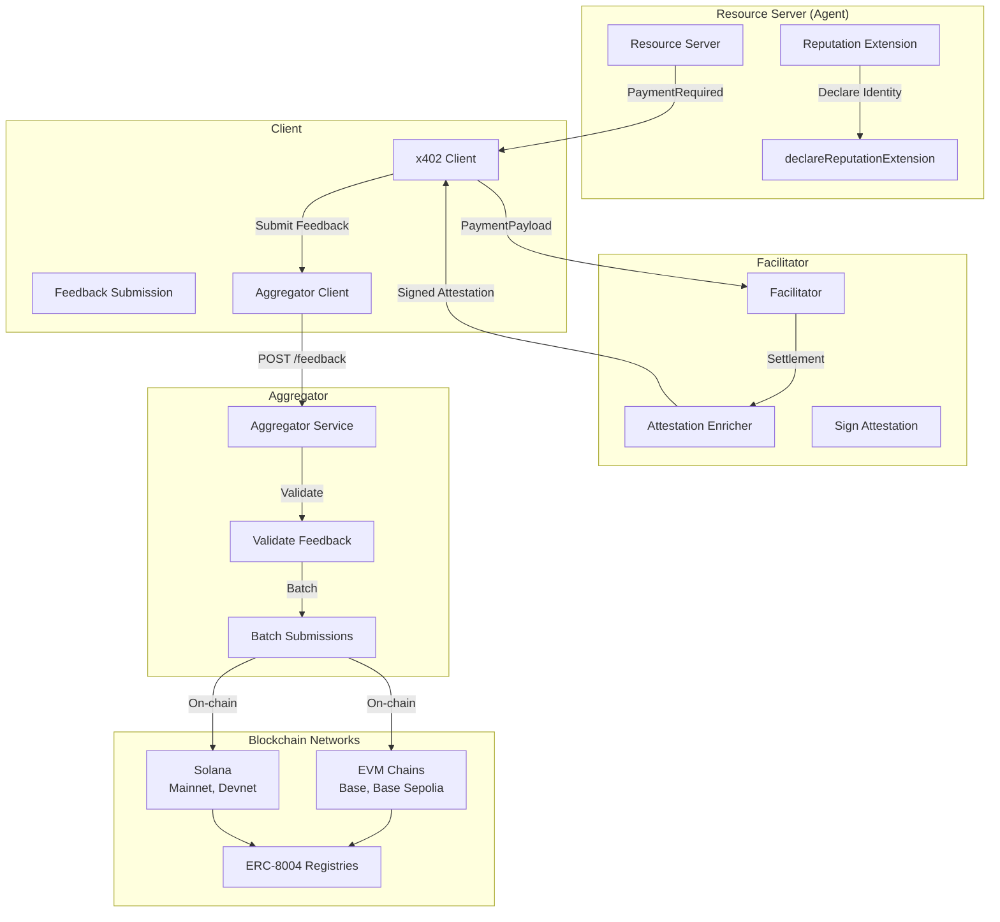
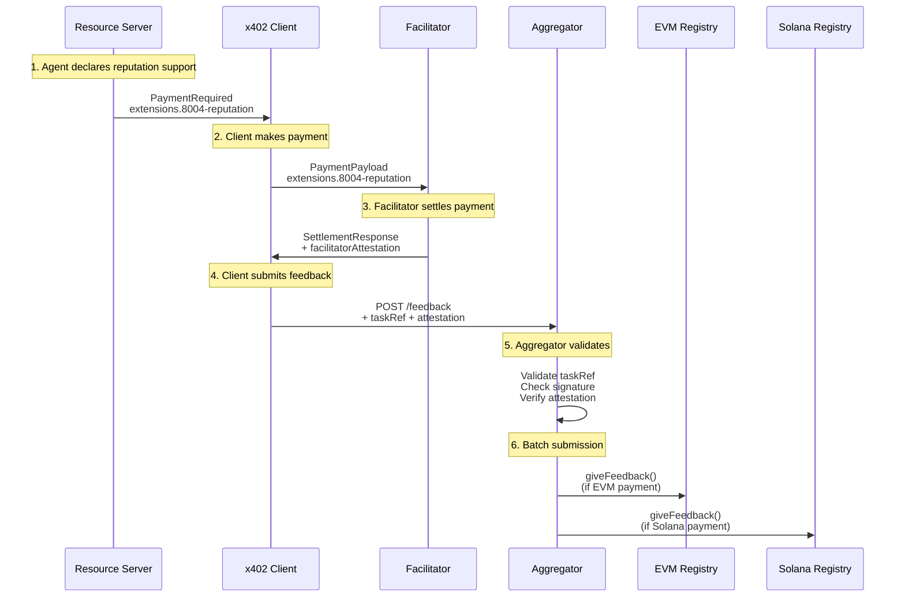
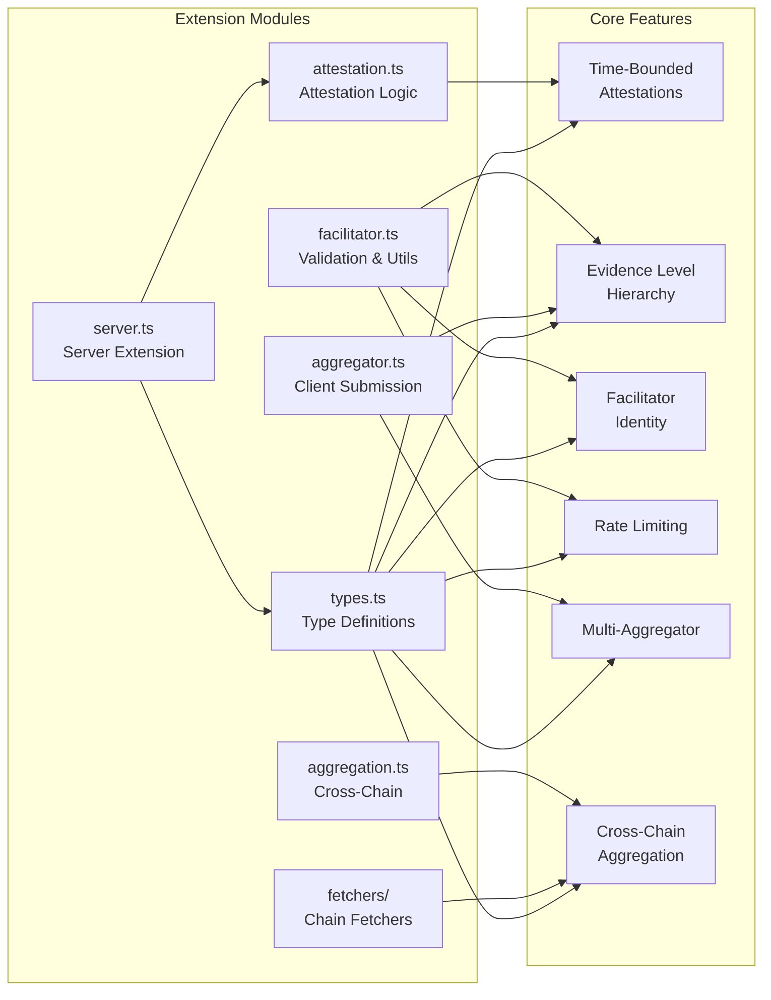
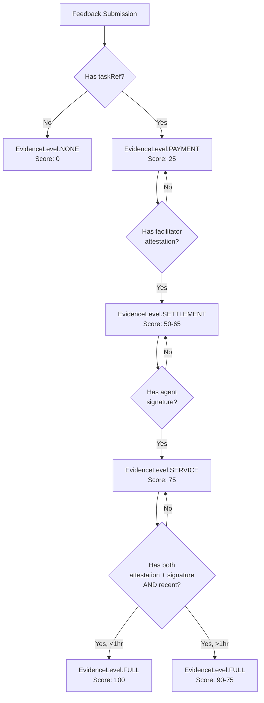
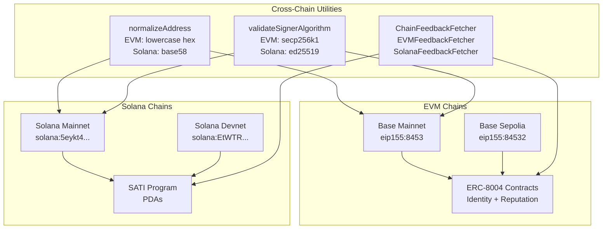
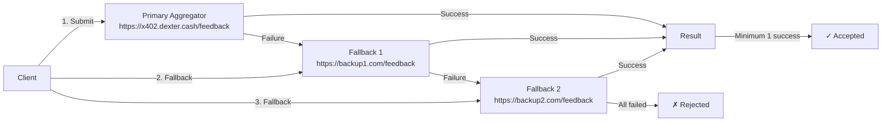
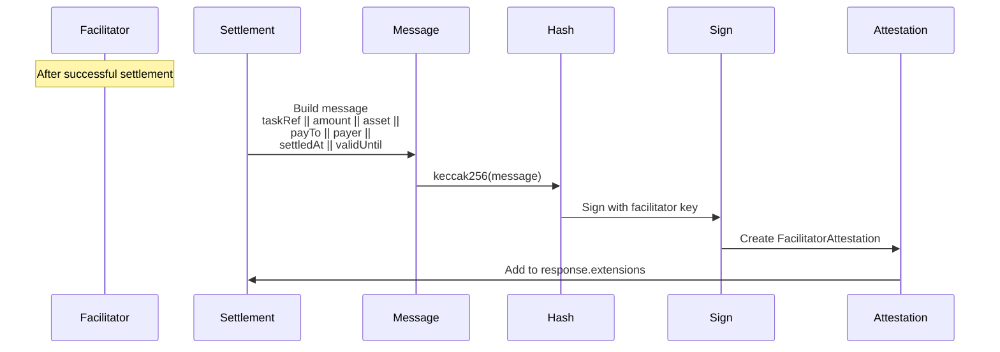
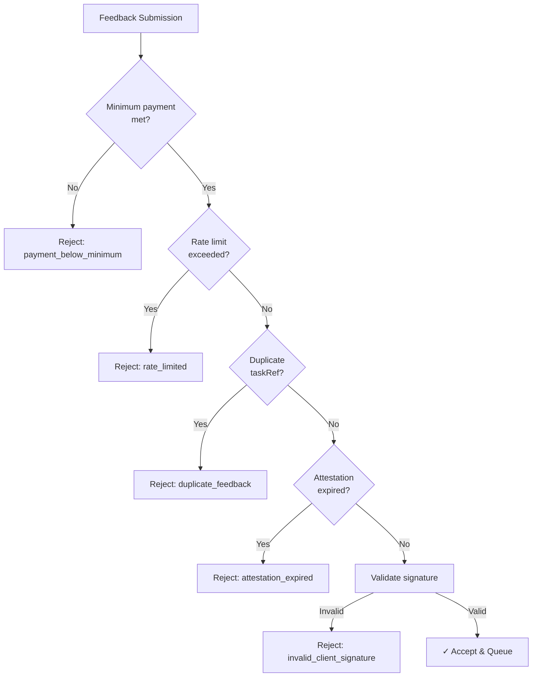
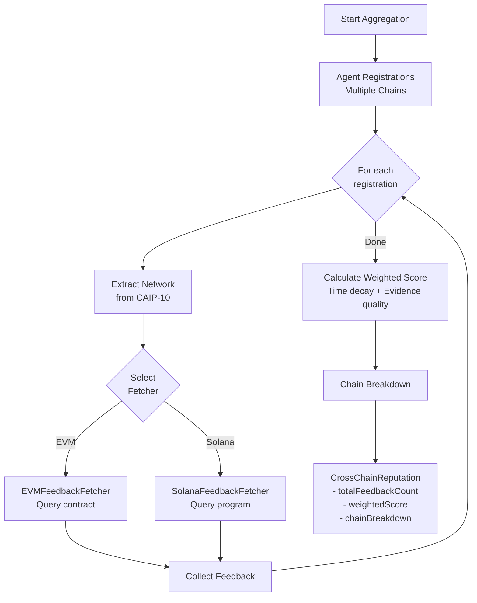

# 8004-Reputation Extension Architecture

## System Overview



## Reputation Flow



## Component Architecture



## Evidence Level Hierarchy



## Cross-Chain Support



## Multi-Aggregator Flow



## Facilitator Attestation Flow



## Rate Limiting & Spam Prevention



## Cross-Chain Aggregation Process



## File Structure

```
typescript/packages/extensions/src/reputation/
├── types.ts              # Core type definitions
├── attestation.ts        # Facilitator attestation creation/verification
├── aggregator.ts         # Client feedback submission
├── facilitator.ts        # Validation & utility functions
├── server.ts             # Server extension & declaration
├── aggregation.ts        # Cross-chain reputation aggregation
├── index.ts              # Public API exports
└── fetchers/
    ├── index.ts          # Factory for chain-specific fetchers
    ├── evm.ts            # EVM feedback fetcher
    └── solana.ts         # Solana feedback fetcher
```

## Key Enhancements Summary

| Enhancement | Module | Key Features |
|------------|--------|--------------|
| **Time-Bounded Attestations** | `attestation.ts` | `validUntil` field, expiration validation |
| **Evidence Hierarchy** | `facilitator.ts`, `aggregator.ts` | 5 levels (NONE→FULL), auto-computation |
| **Facilitator Identity** | `facilitator.ts` | ERC-8004 validation, cross-chain address normalization |
| **Rate Limiting** | `facilitator.ts` | Per-client limits, minimum payment checks |
| **Multi-Aggregator** | `aggregator.ts` | Fallback endpoints, parallel submission |
| **Cross-Chain Aggregation** | `aggregation.ts`, `fetchers/` | Chain-specific fetchers, weighted scoring |
