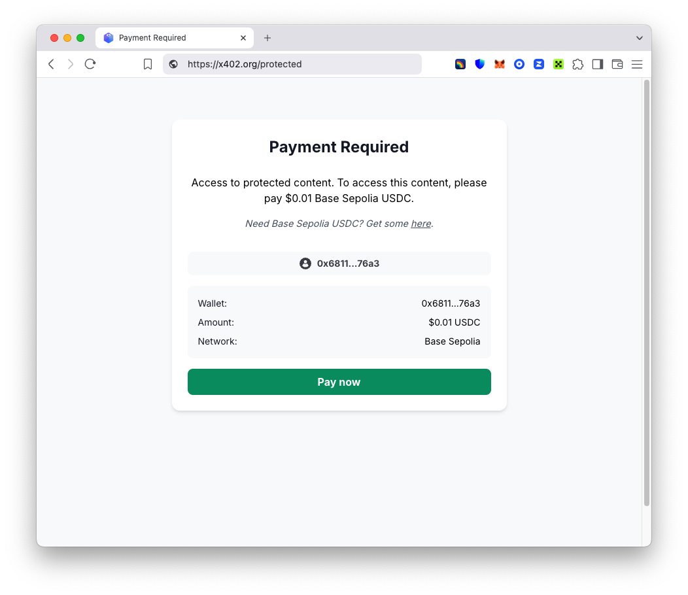

# x402 Paywall

The x402 paywall is designed to work with x402 middleware-enabled servers and handles wallet connection, network switching, USDC balance checking, and payment processing automatically.

## Configuration

The paywall config takes an optional [CDP Client API Key](https://docs.cdp.coinbase.com/get-started/docs/cdp-api-keys) from the [Coinbase Developer Platform](https://portal.cdp.coinbase.com/projects/api-keys/client-key).

In your middleware:

```typescript
export const middleware = paymentMiddleware(
  address,
  {
    "/protected": {
      price: "$0.01",
    },
  },
  {
    cdpClientKey: "your-cdp-client-key",
    appLogo: "/logos/your-app.png",
    appName: "Your App Name",
  },
);
```

## Configuration Options

| Option | Description |
|--------|-------------|
| `cdpClientKey` | Coinbase Developer Platform [Client API Key](https://docs.cdp.coinbase.com/get-started/docs/cdp-api-keys) (requires a CDP account) |
| `appLogo` | Your app's logo for the paywall wallet selection modal |
| `appName` | Your app's name displayed in the paywall wallet selection modal |


## Usage

The paywall automatically loads when a browser attempts to access a protected route configured in your middleware.


